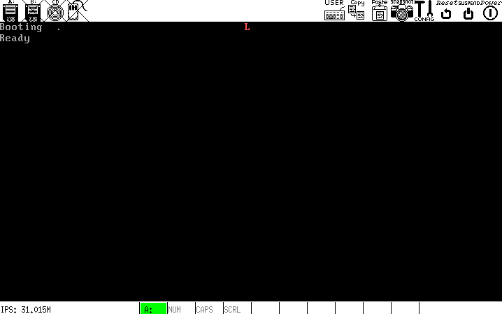

# b
在引导扇区的 512 字节限制内完成一下任务:

- 在 A 盘根目录下寻找 LOADER.BIN 的记录，若找到则定位到文件数据，将其拷贝到 BaseOfLoader，然后跳转过去执行 Loader 的代码.

这是一个非常复杂的过程，`FileSys/Fat12/base/`里面有一个解析`FAT12`文件系统的demo，`os/ch04/a/`也有一个实验，两者都是我做的详细笔记.

**说明**
- 整体思路和 FAT12 软盘头部的设计均来自《一个操作系统的实现》，全部代码由我编写并调试成功.

## 运行结果

## 内存使用情况
* `0 ~ 7C00h` 栈 (栈底 = 7C00h)
* `7C00h ~ 7E00h` 引导区
* `7E00h ~ 9000h` FAT1 专用读缓冲区 (len = 9 * 512 = 0x1200)
* `9000h ~ AC00h` 根目录区专用读缓冲区 (len = 14 * 512 = 0x1c00)
* `AC00h ~ AE00h` 扩展缓冲区 (len = 512, 未使用)
* `AE00h` LOADER.BIN 被加载到的基地址
> 开辟 3 块缓冲区是为了防止读写重叠导致错误. 控制权转交后这些内存的使命随之结束，可供他者使用.