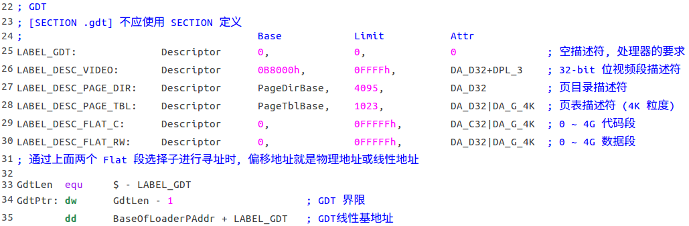
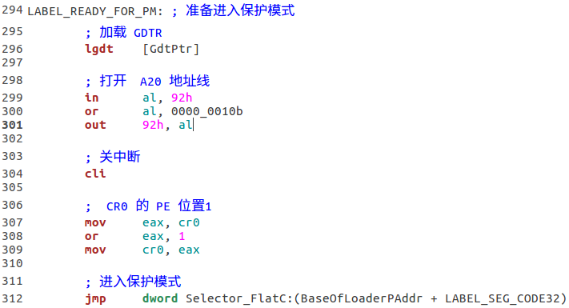
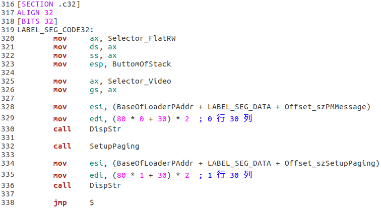
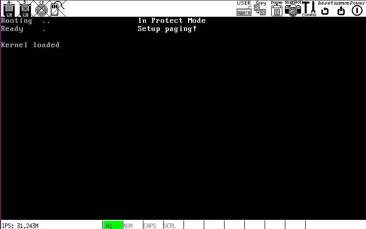
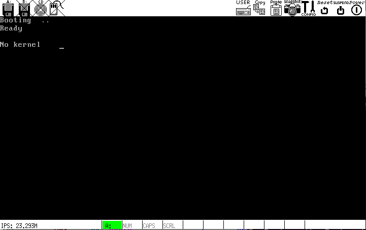

# c

## 关于重定位的问题
### org 指令
NASM 允许我们使用`org`指令指出程序的期望加载地址，这个地址是**偏移地址**，是基于实模式下的段地址或保护模式下的段选择子的偏移量.

### *.ASM 文件中的标号
NASM 允许我们定义全局标号和局部标号(以 . 开头)，二者在编译后没有区别. 程序编译后，标号的数值称为**汇编地址**，该地址在数值上等于**[ 程序的期望加载地址(即`org`指出的地址) + 标号处的指令的第一字节相对程序开头的偏移量 ]**. 例如:
```
org 7c00h
    nop
    nop
    nop
label:
    mov ax, label
```
其中`label`的数值为`7c03h`

### 在 Loader 中如何解决重定位的问题
MBR 负责将 Loader 加载到指定位置后跳转过去执行之，如果要使 Loader 能够正常运行，要么进行重定位，要么加载到 Loader 的期望加载地址处. 重定位无法实现，所以我选择后者. 只是要注意，`org`指令后面的地址是**偏移地址**，不是段地址，不是物理地址或线性地址.

##　Loader 的任务
Loader 不是操作系统的一部分，它的任务应该包括(顺序分先后):

* 加载 ELF 格式的 Kernel 进内存
* 切换到保护模式，初始化 Kernel 的工作环境，具体包括:
    * 显示一些提示信息
    * 启动分页
    * 整理内存中的 Kernel 并转交控制权
    * (本目录下先完成前两项)

## 代码说明
- `loader.asm`加载`kernel.bin`的核心代码和`boot.asm`相同，只是文件名和加载地址的差异
- `loader.asm`与保护模式相关的代码应该尽可能简洁，GDT 描述符只应包含必要的几个:



- `loader.asm`进入保护模式的代码:



从中可见，初始化描述符的代码不见了，这得益于 GDT 中定义的两个 Flat 段描述符，可以直接使用物理地址或线性地址进行寻址.

- `loader.asm` 32-bit 代码段:



其中用到的函数都是**直接**从`ProtectMode/ch17/a/`拿过来的.

## 运行结果
### 有 kernel.bin


### 无 kernel.bin

