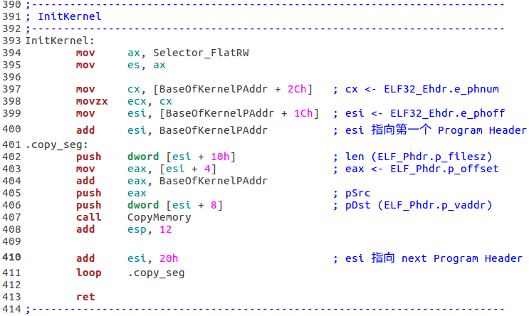
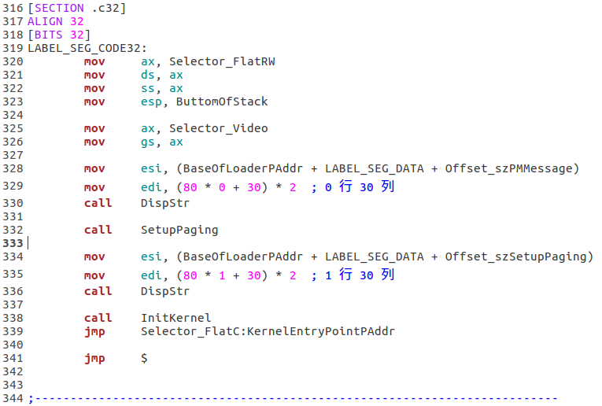
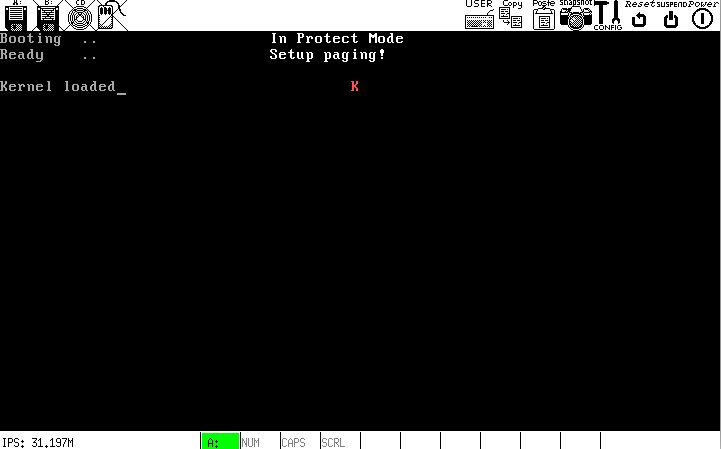

# d
`kernel.bin`已被加载，现在需要根据 ELF 格式信息进行整理.

## 要做的:
* 把 ELF 文件中的`Program Header Table`描述的*段(segment)*放置到内存中正确的位置

## 问题:
* *需要拷贝多少个段?* => ELF32_Ehdr.e_phnum (2 bytes, file-offset = 0x2C)
* *从哪开始拷贝?* => `Program Header Table`由好多`Program Header`组成, 每个`Program Header`的`ELF32_Phdr.p_offset`(4 bytes, 相对当前`Program Header`开头的偏移是 0x4)指出了一个段的第一字节的文件偏移
* *拷贝到哪?* => ELF32_Phdr.p_vaddr (4 bytes, 相对当前`Program Header`开头的偏移是 0x8)
* *拷贝的字节数?* => ELF32_Phdr.p_filesz (4 bytes, 相对当前`Program Header`开头的偏移是 0x10)

## 伪代码:
```
loop_times = ELF32_Ehdr.e_phnum

for each Program_Header:
    pSrc = BaseAddr + Program_Header.p_offset
    pDst = Program_Header.p_vaddr
    size = Program_Header.p_filesz
    
    CopyMemory(pDst, pSrc, size)
end
```
具体实现:



在 32-bit 代码段内调用`InitKernel`后就可以进入内核了:



其中, `BaseOfKernelEntryPAddr`定义在`include/load.inc`里，该值必须与`Makefile`里的相同:

`load.inc`


`Makefile`


## 运行结果显示，我们已经成功进入内核


## 内存使用情况
* `0 ~ 0x7c00` Free
* `0x7c00 ~ 0x7e00` MBR
* `0x7e00 ~ 0xae00` Stack
* `0xae00 ~ 0xb200` Loader (占据两个扇区)
* `0xb200 ~ 0x1b000` 文件`kernel.bin`，并不是可用的内核, 大小为 64K - 512B
* `0x1b000 ~ ...` 真正的内核 (内核的入口虚拟地址为`0x1b200`，其加载基地址`p_vaddr`被 4K 对齐为`0x1b0001)
* `0xb8000 ~ 0xc8000` 显存, 64K