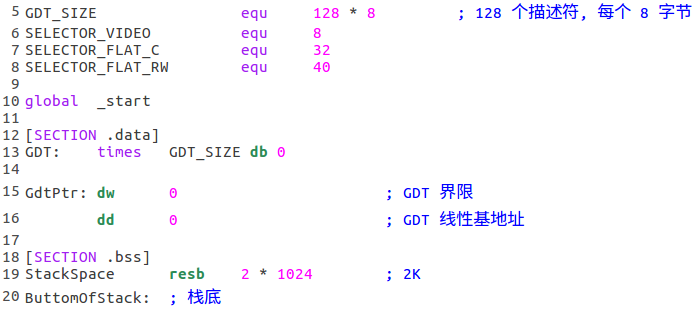
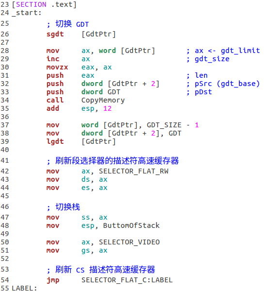
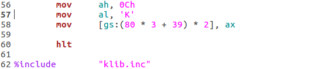
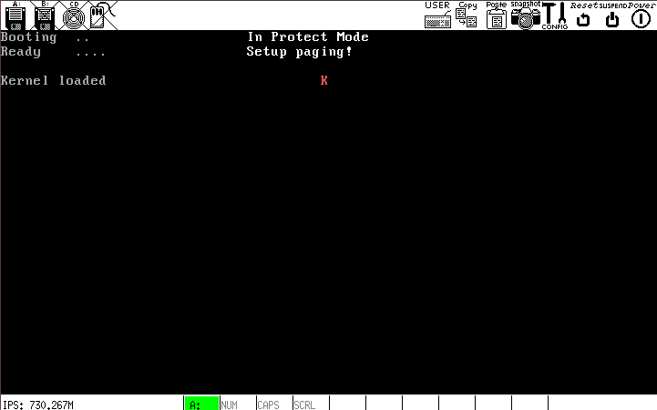

# e

## 扩充内核，在内核中完成两项任务:
- 切换 GDT
- 刷新描述符高速缓存器，同时切换栈

## `kernel.asm`说明
- 常量、`.data`段和`.bss`段

- `.text`段

切换 GDT 时，先将原来的描述符拷贝到`.data`段里，然后`lgdt`重新加载 GDTR. 为了使新的 GDT 生效，必须刷新段选择器的描述符高速缓存器，这里用到的`SELECTOR*`常量尽管数值上和`loader.asm`里的相同，但描述符高速缓存器的内容还是旧值，因此必须刷新，使其与新的 GDT 对应.

还需要强调的是，代码中对标号的使用：两个 Flat 段的定义允许程序中直接使用线性地址或物理地址进行寻址；结合`c`部分`README.md`对标号的说明和内核的加载情况可知，`kernel.asm`里的标号的数值就是**线性地址**.

## 运行结果
