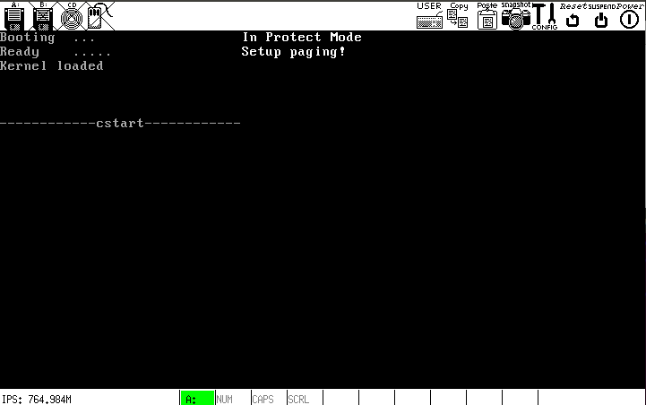

# f
在继续扩充内核前，有必要测试一下 C 和汇编的交叉调用.

## 函数调用情况
### `kernel.asm`
* 将之前使用的`CopyMemory`更名为`memcpy`并定义为`extern`，由`lib/klib.asm`导出
* 定义并使用外部符号`cstart`，由`kernel/start.c`导出

### `start.c`
* 使用外部符号`println`，由`klib.asm`导出

## 编译链接方法
见`Makefile`

## 遇到的问题
### problem 1
链接完成后，`loader.asm`调用`InitKernel`时出现问题，原因是`kernel.bin`的`Program Header`里出现了奇怪的部分. 经调试发现，拷贝段(segment)的时候，似乎仅应拷贝`p_type`字段为`0x00000001`的`Program Header`描述的段，故修改`InitKernel`如下:

### problem 2
修改了`InitKernel`后，`loader.bin`已超过`原先划定号的两个扇区并与`kernel.bin`发生冲突，需要修改`boot/load.inc`，重新设定`kernel.bin`的加载地址`BaseOfKernel`

## 运行结果
