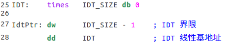
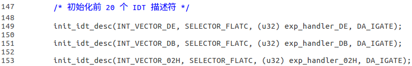
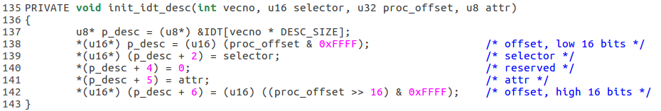
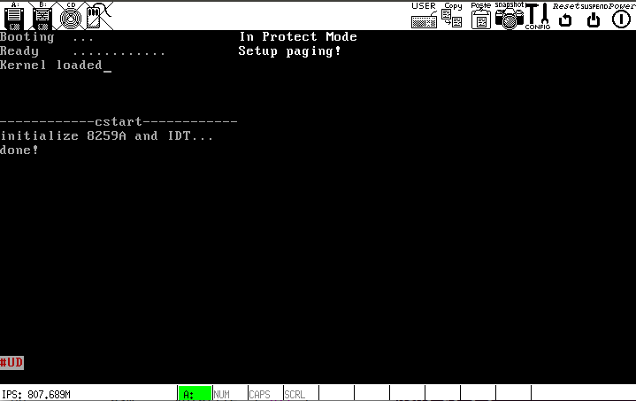

# g
在内核中初步添加中断异常处理.

## 1. 准备 IDT
在`kernel.asm`的`.data`段添加以下内容:

由图可见，IDT 的界限和线性基地址已经固定，只有 IDT 描述符需要填充. 填充 IDT 描述符的代码在`kernel/start.c`里:

<1>

<2>

目前的中断处理例程定义在`kernel/start.c`里，只是简单的显示一条消息.

`kernel.asm`内`call cstart`之后加载`IDTR`，中断处理机制随即开启，不过暂时不能使用`sti`，因为 8259A 的硬件中断处理例程还未准备好.

## 运行结果

## problem
中断和异常的处理存在的问题：无法获取异常信息(eip, cs, eflags和错误代码)
