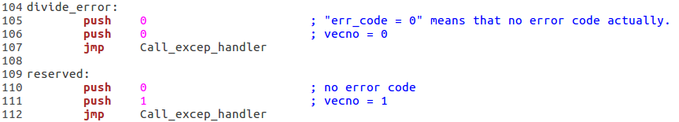
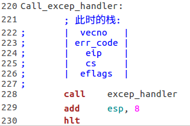
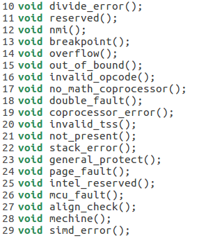
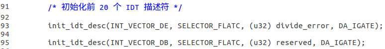
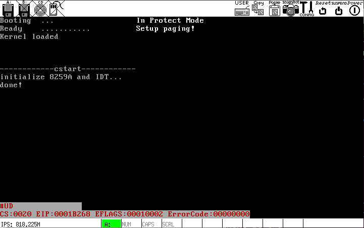

# h
完善中断处理，使其能获取相关信息: eip, cs, eflags, err_code

## 代码说明
在`kernel.asm`里定义一堆符号(函数), 并使用`global`导出:

> `err_code`说明：对于没有错误代码的异常，将 0 压栈作为"错误代码"，否则`excep_handler`无法正确获取信息.

这些符号最后`jmp`到这里:

`excep_handler`是在`start.c`里定义的中断处理例程:

要在`start.c`里使用`kernel.asm`导出的符号，必须添加函数原型:

然后修改`init_idt_desc`的调用, 将这些函数作为中断处理例程:

如此一来，当中断发生时根据*无特权级转移条件下的堆栈情况*可知，`excep_handler`就可以获得`中断向量vecno`和`错误代码err_code`以及相关寄存器的信息.

## 运行结果

## More
大部分库函数和其他代码细节我懒得更没必要在此提及(反正都是我写的)，README 仅解释整体设计.