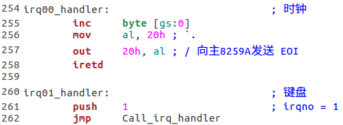
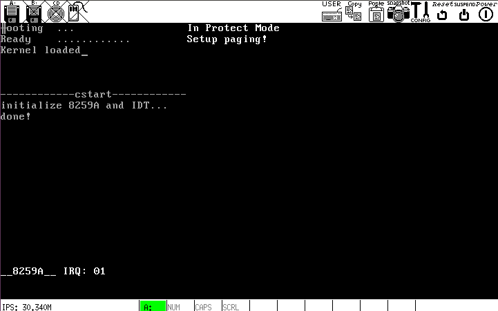

# i
添加主从 8259A 中断处理例程

## `start.c`

`irq_handler`只是打印 IRQ 号.

## `kernel.asm`

这些符号是传递给`init_idt_desc`的参数，是中断处理的入口，除了时钟中断外，最终将调用`start.c`定义的`irq_handler`函数.

## 运行结果
修改`8259A.asm--init_8259A`，使主从芯片可以接收所有中断，并在`kernel.asm`里`sti`开中断.

下图是时钟中断的同时，随意按键后的效果:

## 总结
至此，内核框架初步搭建完毕. 内核的主要工作包括:

- 切换 GDT
- 刷新段选择器
- 安装 IDT, 启动中断异常处理系统