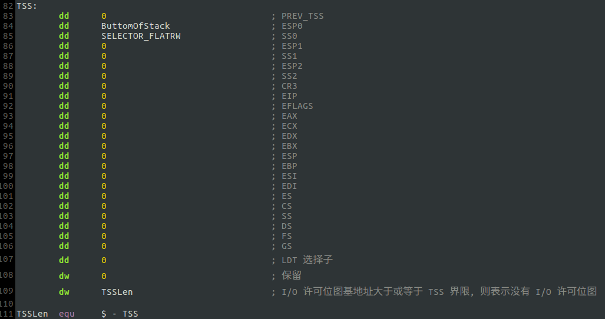
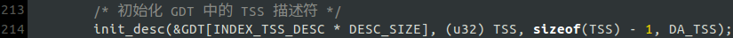
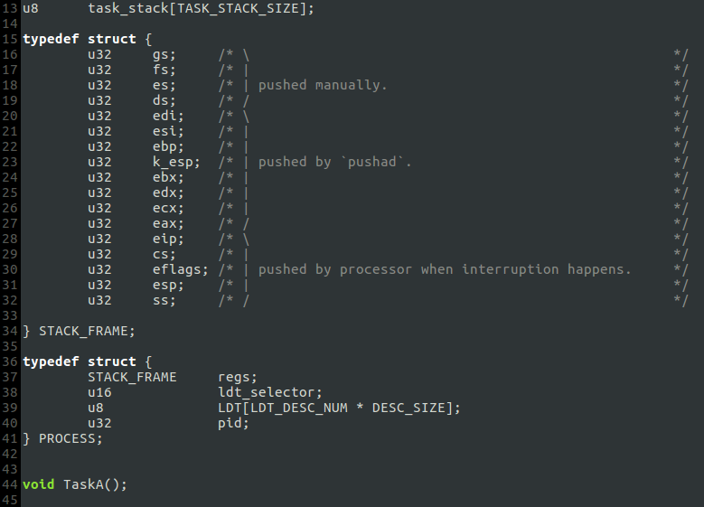
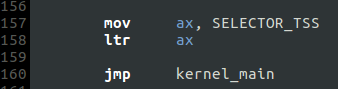
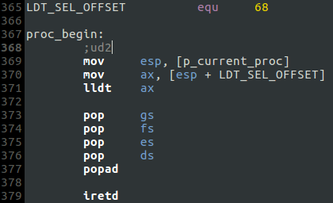
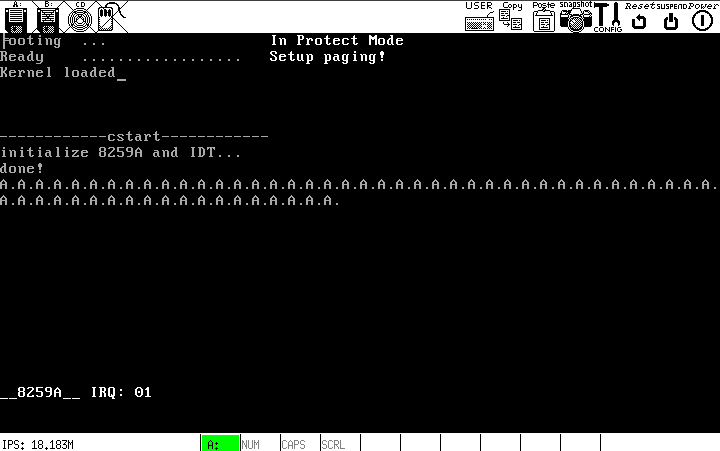

# a. 第一步: ring0 -> ring3
内核运行在 ring0, 进程运行在 ring3, 即需要从内核空间进入用户空间.

**整体思想框架:** 从用户空间进入内核空间的渠道是*中断和异常*, 中断例程结束后可以返回用户空间. 所以，可以在内核中"虚构"一个发生中断后的环境，借此跳入用户空间，该思想与通过调用门从 ring0 转移到 ring3 相似，具体参见`ProtectMode/ch14/b`.

## 步骤
### step1 -- 准备 TSS
* <1> `kernel/kernel.asm`里定义数据结构并导出符号`TSS`:

* <2> `kernel/start.c`里：在 GDT 中安装 TSS 描述符:

### step2 -- 准备与进程相关的数据结构
* <1> `kernel/proc.h`里定义数据结构:

* 说明
    * `task_stack` 进程栈. 特权级转移时会发生栈切换，而进程栈就是位于 ring3 的栈.
    * `STACK_FRAME` 扩展栈, 进程表的一部分. 存储进程状态信息时，必要的寄存器被压栈保存，此时应使用该数据结构.
    * `PROCESS` 进程表. `regs`存储寄存器信息, `ldt_selector`和`LDT`是与进程的 LDT 相关的部分(每个进程应该是独立的，具有独立的地址空间，要实现这一点就必须为每个进程准备一套独立的 LDT).
    * `void TaskA();`　进程体声明(函数声明).

### step3 -- 准备 LDT, 初始化进程表
* <1> `kernel/main.c`

* 说明
    * 为了简单，每个进程的 LDT 仅包含一个 0~4G 的代码段和 0~4G 的数据段，显存段的选择子直接使用 GDT 里的.
    * `ss`, `esp`, `eflags`, `cs`, `eip` -- 假如进程运行时发生中断，就会从 ring3 切换到 ring0；对于有特权级转移的中断发生时，处理器会向新栈(本例的"新栈"是内核栈)**依次**压入: 中断发生时的`ss`和`esp`, `eflags`以及中断的返回地址`cs`和`eip`，具体参见`ProtectMode/ch17/a`. 对于本例，目的是通过"虚构"的中断"返回"用户空间运行`TaskA`，那么`ss:esp`就应指向进程栈`task_stack`的栈底；`cs:eip`应指向`TaskA`的入口；`eflags`的`IF`置 1 的作用相当于`sti`开启中断.

### step4 启动进程
* <1> `kernel/kernel.asm`
加载`TR`，跳入`kernel_main`:

没有使用`call kernel_main`的原因是，进入用户空间 ring3 后不需要返回，类似于转交控制权.

* <2> `kernel/main.c`

令`p_current_proc`指向待"恢复"的进程表，`proc_begin()`开始运行.

* <3> `proc_begin`实现
`kernel/kernel.asm`

* 说明
    * 首先令`esp`指向进程表的`STACK_FRAME`结构　(`kernel.asm`里的符号`p_current_proc`的数值=`main.c`里的变量`p_current_proc`的地址)；
    * 再取得进程表里的`ldt_selector`，从而加载 LDT；
    * 运行一系列`pop`使得`iretd`时，`esp`指向`STACK_FRAME.eip`，就可以完成特权级转移和堆栈切换，并开始运行`TaskA`. 
   
## 运行结果

可以看到，时钟中断例程和`TaskA`互不影响地在运行.

## 疑惑
回顾整个过程，似乎`TSS`并无存在的必要，但是如果不使用`ltr`加载`TR`，进程`TaskA`打印一次后系统就崩溃. 分析可知，本例的大环境是主 8259A　所有中断被开启, `TaskA`运行时如果发生时钟中断，就涉及 ring3 -> ring0 的切换，所以如果不正确设置 TSS, 堆栈切换就无法完成. 但是，如果屏蔽主8259A的中断，不使用 TSS 也可以.