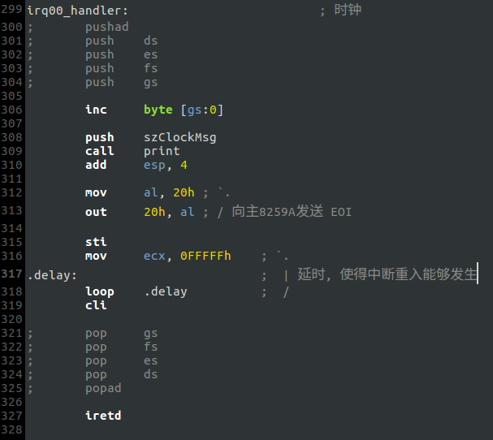
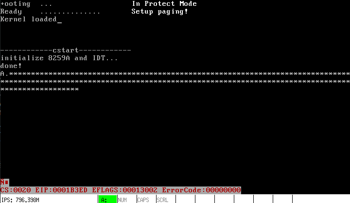

# c. 实验: 中断重入
中断响应过程中, CPU会自动关闭中断, 要想打开中断则需要`sti`指令. 如果在时钟中断响应过程中发生中断重入, 即再发生一个时钟中断, 那么程序就会回到中断例程开头, 使得`iretd`指令无法执行, 也就无法返回`TaskA`.

- 实现代码如下:

- 运行结果:

每次发生中断时，相关寄存器被压栈，然而`iretd`无法执行，因此最终将导致溢出并造成不可预料的结果.

