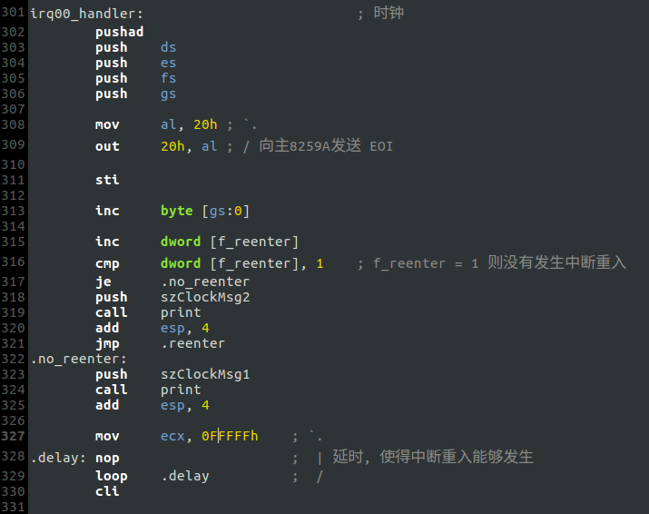

# d. 解决中断重入的问题
### 修改后的时钟中断例程:

- 说明
    - 保存现场后立即向主8259A发送`EOI`，使其能够马上接收新的中断
    - `f_reenter`是`main.c`定义的`int`变量，初始值为0. 借助`f_reenter`判断当前中断是否是一次"重入"的中断，并选择不同的分支
    - 中断例程的各部分代码的排放顺序是反复调试后得到的，任何改变都可能使系统崩溃

### 运行结果分析

- "重入"的中断打印"+"，非"重入"的中断打印"*". 中断重入持续发生，但依然能回到`TaskA`
- 如果`中断A`在运行期间发生中断重入，"重入"的中断假设为`中断B`，则`中断B`的返回地址是`中断A`被打断的位置，然后`中断A`将继续运行，并且肯被再次打断. --**这一点非常重要!!!**
