# e. 多进程

## 如何添加一个进程?
**每个进程有一套独立的 LDT 和栈，若要添加一个进程，只需给进程表`proc_table`增加一项并初始化即可.**

下图是之前初始化进程表的代码:

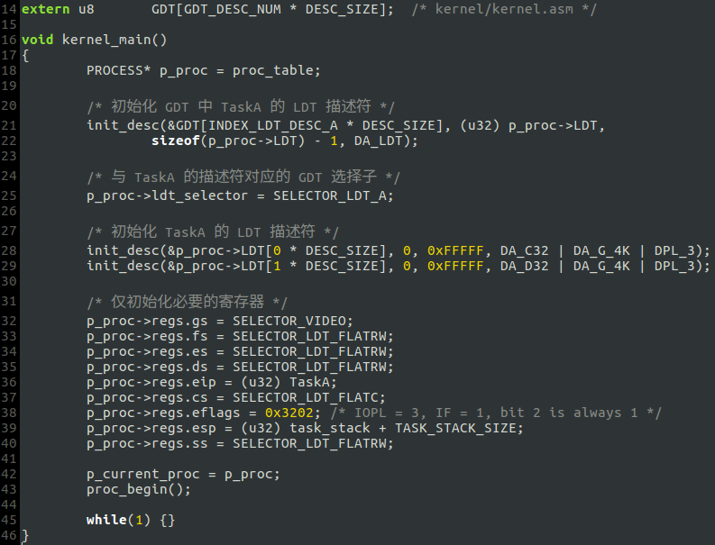

由图可见，每个进程特有的部分只是*进程入口*和*栈*，为了能够在循环中初始化进程表，将进程特有的两个变量抽离出来，定义为`TASK`结构(`include/proc.h`):

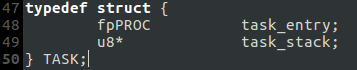

另外，删除`INDEX_LDT_DESC_A`和`SELECTOR_LDT_A`两个常量，取而代之的新的常量定义:

(这两个新定义的常量将在`kernel_main`中循环初始化进程表时发挥作用)

基本的修改完成后，再增加新的部分:

* <1> 进程函数体和函数声明

在`kernel/main.c`里添加进程函数体:

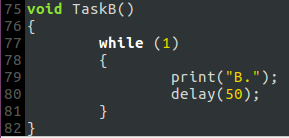

并在`include/proc.h`里添加函数声明(图略)

* <2> 在`include/proc.h`定义新增进程的栈:

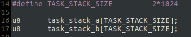

* <3> 在`kernel/main.c`里定义并初始化`TASK`结构数组`task_table`:

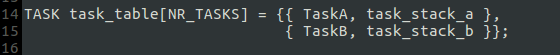

* <4> 修改`kernel_main`，在循环中初始化进程表:

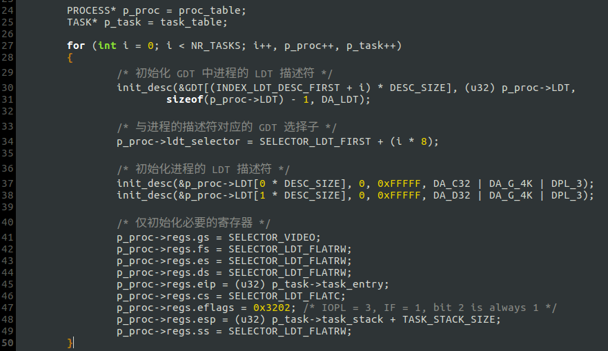

## 如何切换进程?
进程表初始化完成后，通过`proc_begin`进入用户空间的第一个进程`TaskA`:

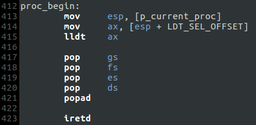

进程运行时会被中断，中断结束后进程又从被中断的位置恢复运行. 因此可以在时钟中断例程里完成进程切换:

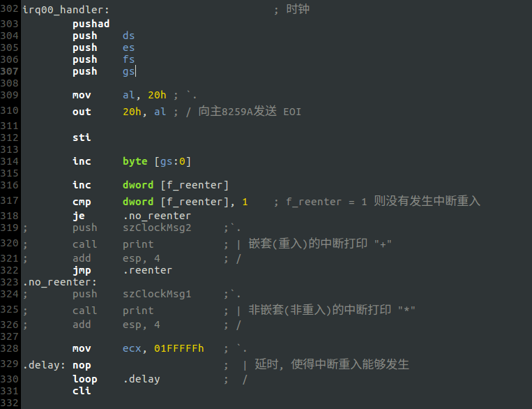
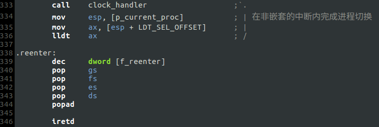

`clock_handler`实现在`kernel/clock.c`里：

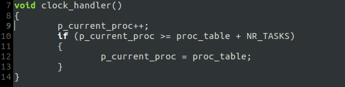

`clock_handler`令`p_current_proc`指向进程表的下一项(使用了回绕).

接下来的部分就和`proc_begin`一致了. 事实上，中断例程的结尾和`proc_begin`的结尾是一致的，只需把`proc_begin`前半部分切换栈和加载 LDTR 的代码移植过来即可. 此处有一个细节，中断例程入口处向内核栈`push`了好多寄存器，现在直接切换栈不会出问题吗？其实，切换栈是为了跳入下一个进程，新的进程运行时势必会被中断，中断发生时处理器又从 TSS 取得内核栈的 SS 和 ESP，而取得的 ESP 是指向栈底的，所以栈被自动平衡而不会溢出.

## 运行结果
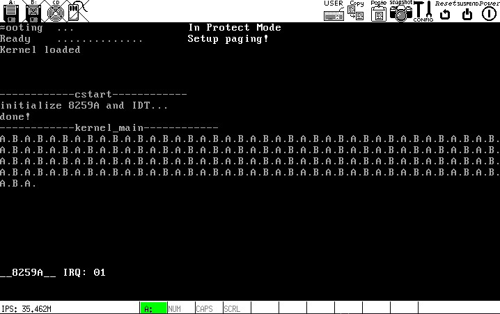

可以看到，`TaskA`和`TaskB`在时钟中断的作用下交替运行.