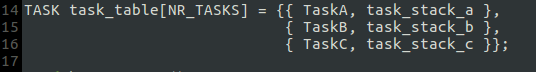
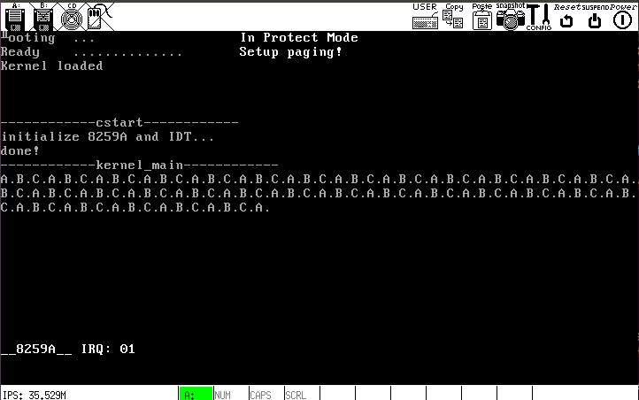

# f. 在 e 的基础上添加一个进程的步骤
### 1. 将`include/sysconst.h`的`NR_TASKS`加一:

### 2. 在`kernel/main.c`里添加进程函数体:

### 3. 在`include/proc.h`里添加函数声明，并定义新增进程的栈:

### 4. 在`task_table`里添加一项(`kernel/main.c`):

### 5. 编译链接并运行:

