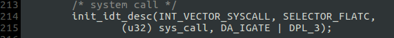
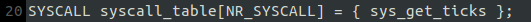
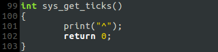
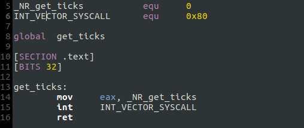
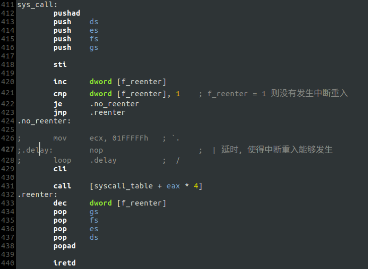
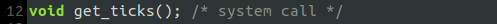
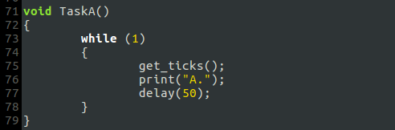
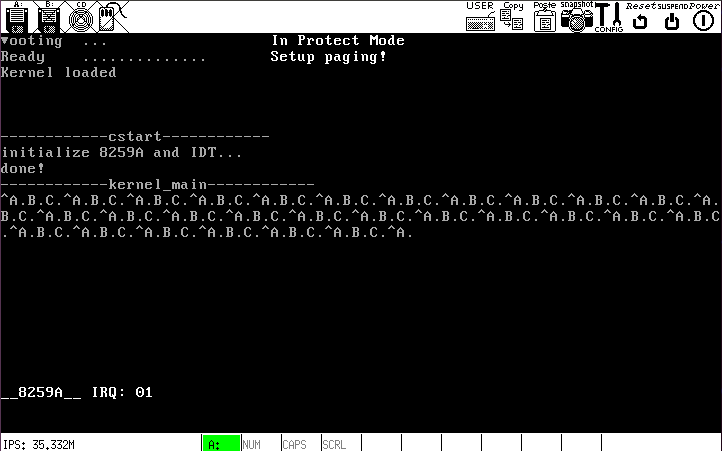

# g. 系统调用`get_ticks`
系统调用`get_ticks`用于获得时钟中断的发生次数.

## 实现系统调用的过程
系统调用的本质是用户进程通过中断使系统进入内核空间运行，也就是基本的特权级变换，本质上与用户进程和时钟中断的交替运行没有区别.

### 1. 设置 IDT
既然要用到中断，就需设置 IDT. 在`kernel/start.c`里添加:

* 说明:
    * `INT_VECTOR_SYSCALL`定义在`include/sysconst.h`，值为`0x80`
    * `sys_call`即中断例程，实现在`kernel/kernel.asm`
    * 必须为中断门指定`DPL_3`特权级，否则用户进程无法使用该中断

### 2. 在`kernel/main.c`里定义系统调用表`syscall_table`

`SYSCALL`定义在`include/type.h`里:

这么定义是为了兼容类型所有的函数指针.

`sys_get_ticks`在`include/proc.h`里声明，在`kernel/main.c`里实现:

### 3. 在`kernel/syscall.asm`里定义系统调用的函数接口

### 4. 在`kernel/kernel.asm`里实现中断例程`sys_call`

`call [syscall_table + eax * 4]`将根据索引值`eax`调用`syscall_table`里的函数(本例为`sys_get_ticks`). 与时钟中断一样，如果发生中断重入则直接退出

### 5. 声明系统调用函数接口并使用

## 运行结果

## 系统调用`get_ticks`的过程
* 调用函数`get_ticks()`
* `get_ticks()`在用户空间引发中断，进入内核空间执行中断例程
* 中断例程根据索引号调用`syscall_table`里的相应函数
* 中断例程从内核空间返回`get_ticks()`到所在的用户空间
* `get_ticks()`返回