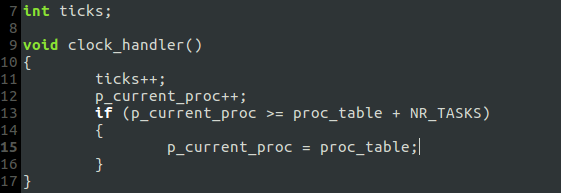
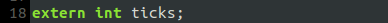
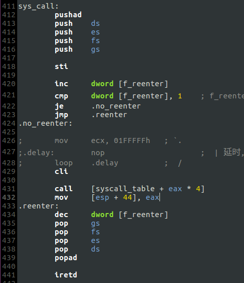
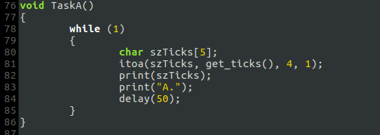
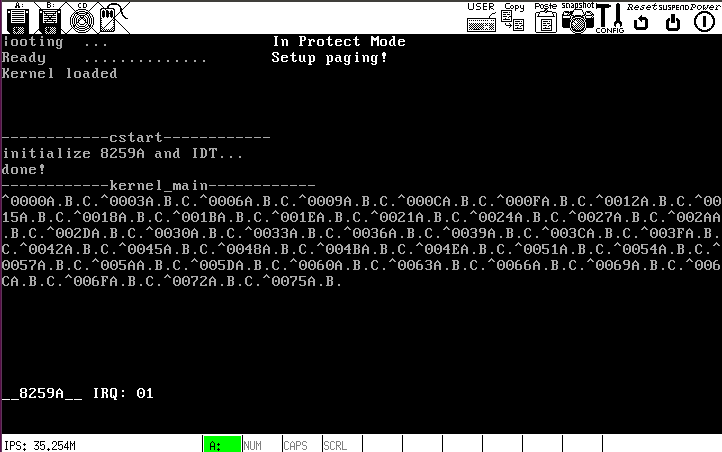

# h. 实现 `get_ticks` 的功能：返回时钟中断的发生次数

## 实现步骤
### 1. 在`kernel/clock.c`里声明全局变量`int ticks`并在 `clock_handler()`里对其自增:

### 2. 在`kernel/main.c`里导入变量`ticks`并初始化:

### 3. 修改`sys_get_ticks()`:

### 4. 修改中断例程`sys_call`:

函数的返回值放在`eax`里，中断例程`sys_call`返回到`get_ticks`后，`eax`里的内容必须是`call [syscall_table + eax * 4]`的返回值；`mov [esp + 44], eax`将`eax`的内容放进栈的正确位置，使得`popad`后`eax`的内容变为`sys_get_ticks()`的返回值，这样`get_ticks()`就能拿到结果.

### 5. 修改`TaskA()`:

## 运行结果

