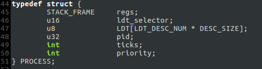
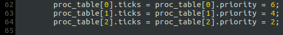
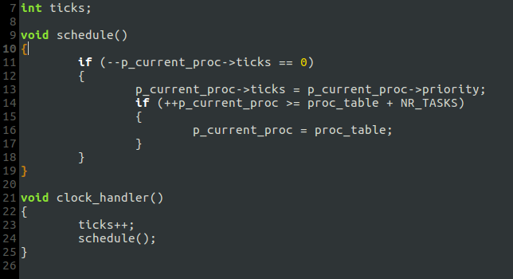
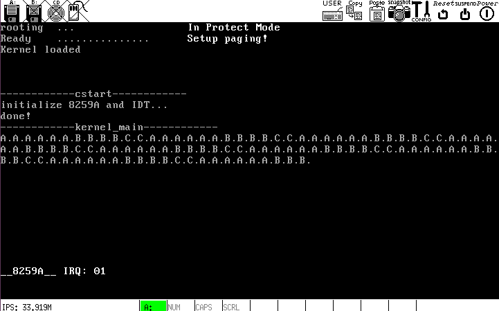

# i. 进程调度
## 算法:
三个进程各有一个`ticks`，从`TaskA`开始运行，每次时钟中断发生时将当前进程的`ticks`递减，当一个进程的`ticks`减为零时就将其恢复到初始值，并切换到下一个进程；当最后一个进程的`ticks`减为零后，回到第一个进程继续.

## 实现:
- 在进程表中添加两个属性:`ticks` & `priority`, 并在初始化进程表时初始化之:

- 修改`clock.c`:

## 运行结果

