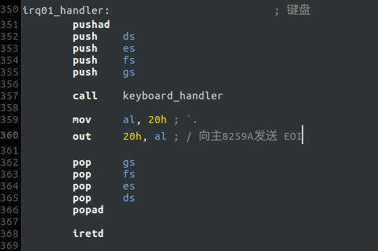
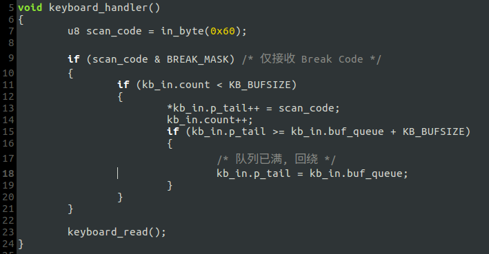
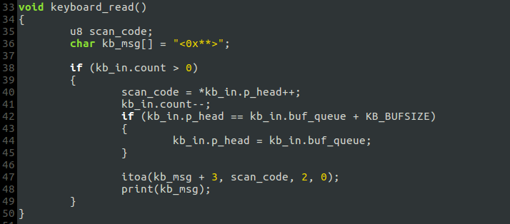
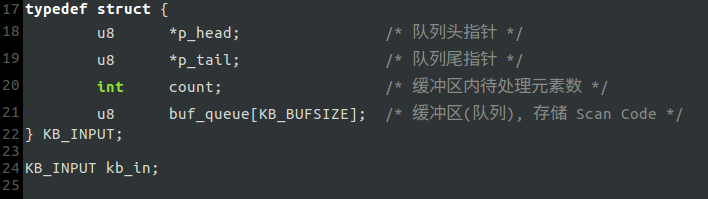
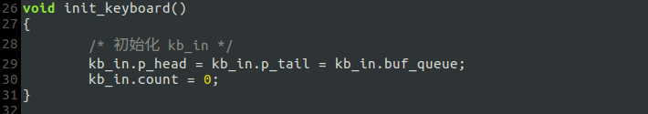
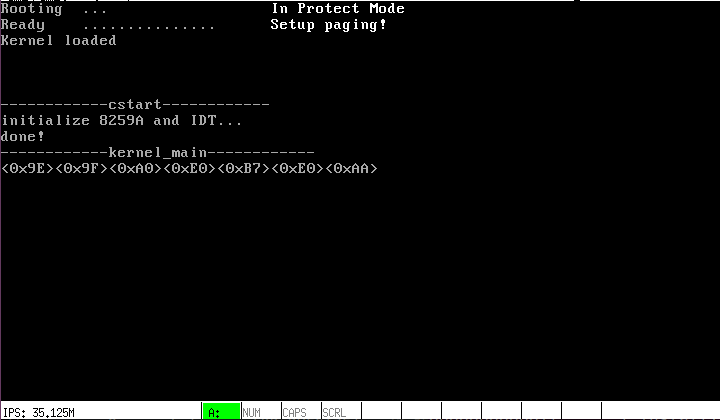

# a. 初步处理键盘中断
## 步骤
### 1. 键盘中断处理程序`irq01_handler`

中断重入对键盘中断的影响可以忽略，故略去相关代码.

### 2. 使用队列接收按键的 Scan Code, 且只接收 Break Code 并打印. 主要函数及数据结构在`include/keyboard.h`和`kernel/keyboard.c`里:

`keyboard_handler`:

`keyboard_read`:

`KB_INPUT`:

在`init_keyboard`里初始化`KB_INPUT`，并在`kernel_main`里调用之:

## 运行结果
将其他进程的打印语句注释掉.

上图是依次按键`A`,`S`,`D`及`PrtSc`的结果.