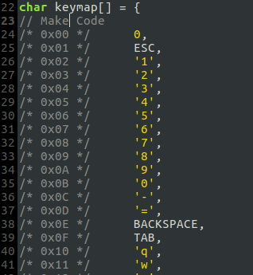
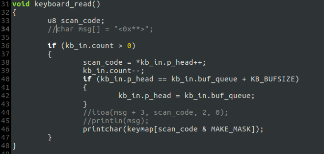
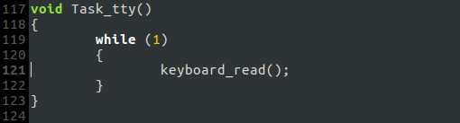
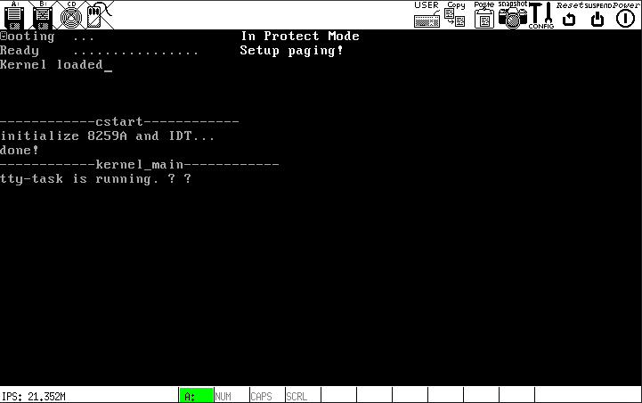

# b. 完善键盘处理，添加终端进程

## 建立"Scan Code(Make Code) - ASCII码"映射表`keymap`:
`include/keymap.h`

不可打印字符同一定义为'?'

根据`keymap`修改`keyboard_read()`，使其打印ASCII字符:

## 添加终端进程(运行在ring3), 读取键盘缓冲区

添加一个进程的步骤在`3/f/README.md`里叙述过了.

## 在`keyboard_handler()`里去除`keyboard_read()`的调用

## 几点修改
- 将`TaskA`, `TaskB`和`TaskC`的循环里的语句注释掉，使其空转；
- 将时钟中断例程`irq00_handler`的延时语句注释掉；
- 修改`TaskA`, `TaskB`和`TaskC`的进程表项(ticks & priority)，使其仅有一次调度机会；将终端进程设置为最高优先级:

## 运行结果

## 总结
- 处理键盘输入时，运行在 ring0 的`keyboard_handler()`将扫描码写入缓冲区，缓冲区的内容被运行在 ring3 的终端进程调用`keyboard_read()`读出并显示. 所以，键盘输入的处理跨越了内核空间和用户空间
- 与终端进程相关的代码杂糅在`main.c`里，应予以剥离
- 需要的改进:
    - 将终端进程放在 ring1, 作为"终端任务"