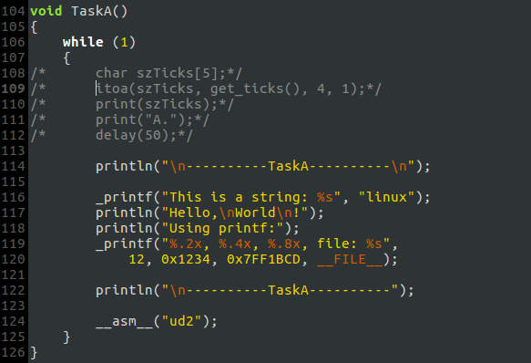
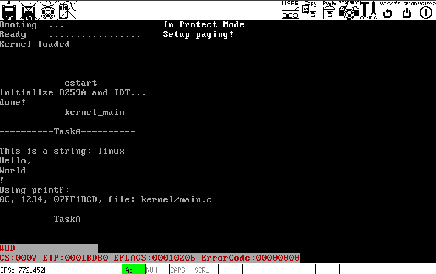

# a. 准备工作：丰富系统的函数库
### 修改 `println` & `print` 处理 '\n' 的 Bug:
`println`:

`print`与此类似.

### 新建 `lib/string.asm`, 实现`strlen`和`strcpy`
(图略)

### 实现`printf`部分功能，相关代码见 `kernel/vsprintf.c` & `kernel/printf.c`

## 测试

> 那些和C库函数同名的统一加下划线区别

