# b. 进程通信
实现基于消息队列机制的进程通信

## 添加系统调用`sendrecv`:
### <1> 在`syscall.asm`里添加系统调用函数接口
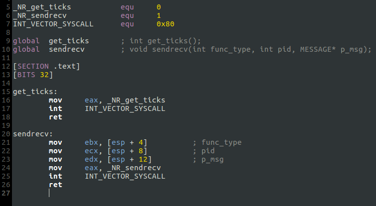

### <2> 在`proc.h`里声明内核态函数`sys_sendrecv`，并在`main.c`里实现
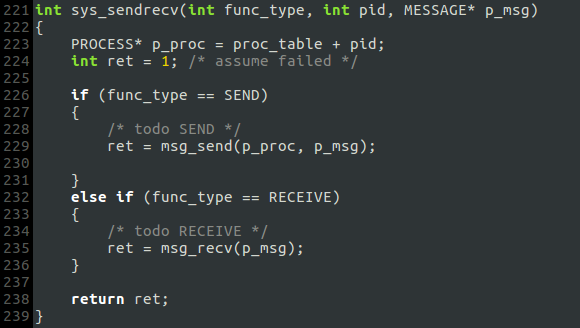

### <3> `NR_SYSCALL` 加一 (sysconst.h)

### <4> 系统调用表里添加函数指针`sys_sendrecv` (main.c)
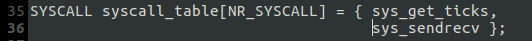

### <5> 在需要用到的地方添加函数原型 (main.c)
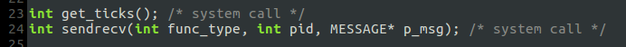

### <6> `sendrecv`的参数与之前的系统调用`get_ticks`不同，需修改中断例程`sys_call`
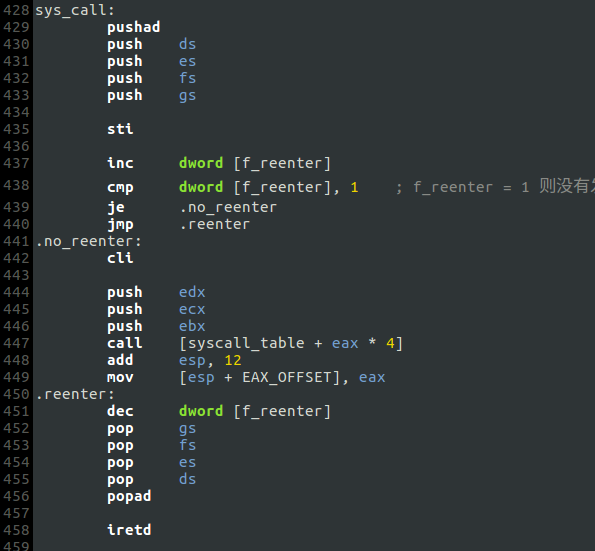

## 消息队列的设计
每个进程维护一个 FIFO 消息队列，用于接收消息. 该队列的设计与键盘输入缓冲区队列的设计相同，依然使用了回绕.

* 消息队列结构 (proc.h)

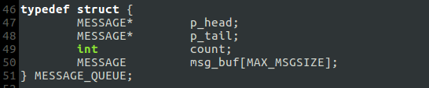

* 新的进程表 (proc.h)

* `init_msg_queue`函数初始化消息队列

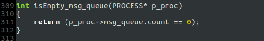

* 在`kernel_main`的主循环里初始化每个进程的消息队列, 以及之前忽视的`pid`

## `msg_send` & `msg_recv`
* `msg_send`
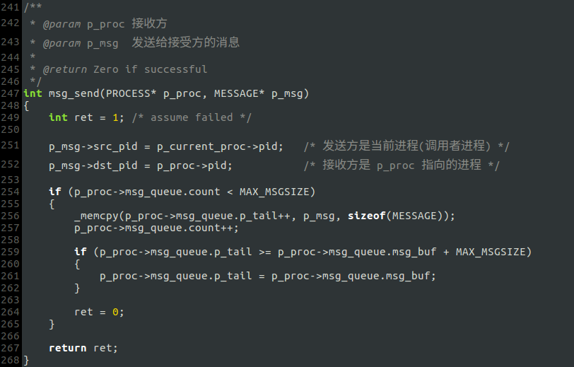

* `msg_recv`
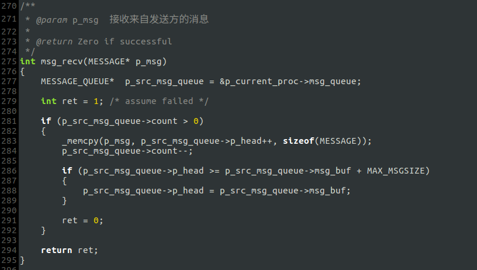

## 辅助函数
* `reset_msg` 将`MESSAGE`结构体清零

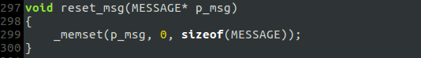

* `isEmpty_msg_queue` 对消息队列判空

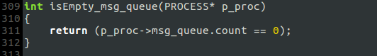

## 测试代码
`TaskA`和`TaskB`依次发消息给`TaskC`:

* `TaskA`

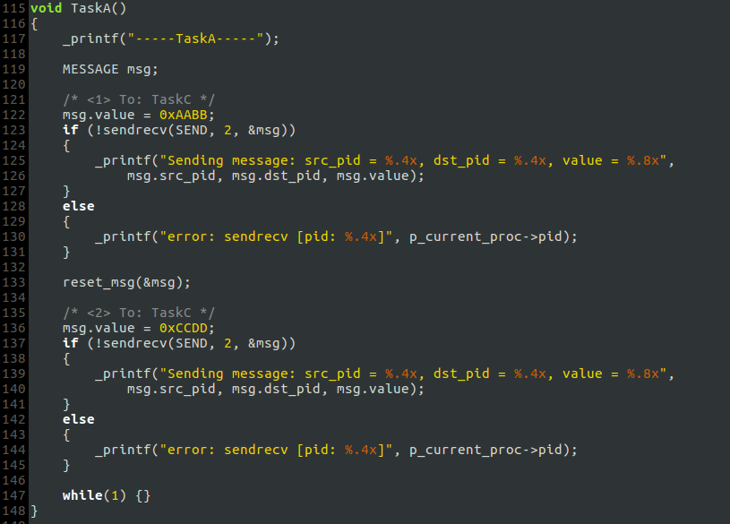

* `TaskB`

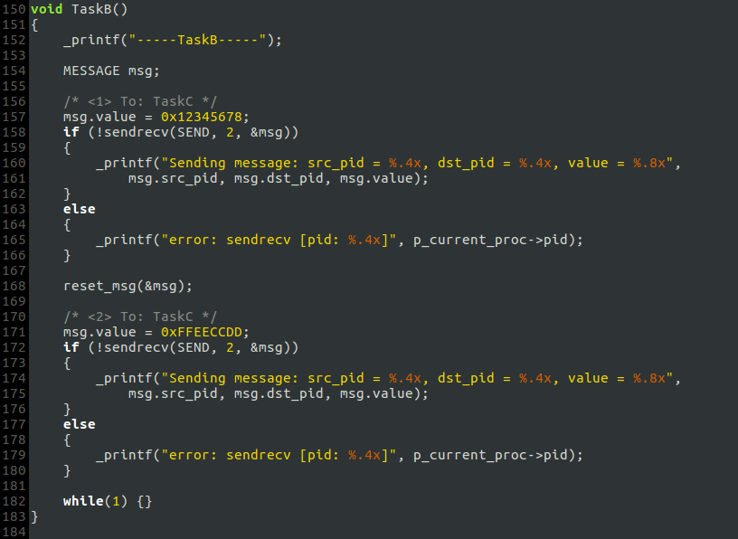

* `TaskC`

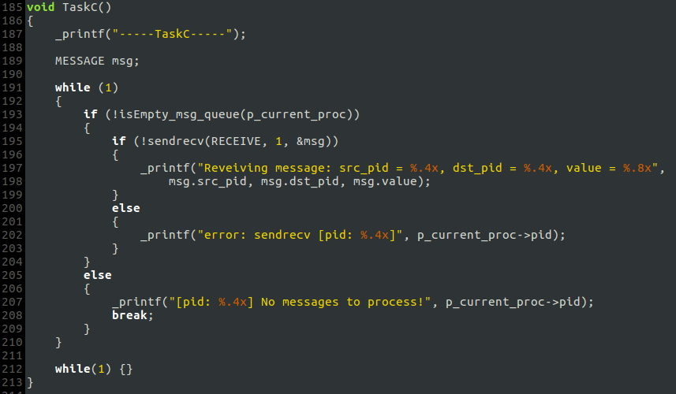

## 运行结果
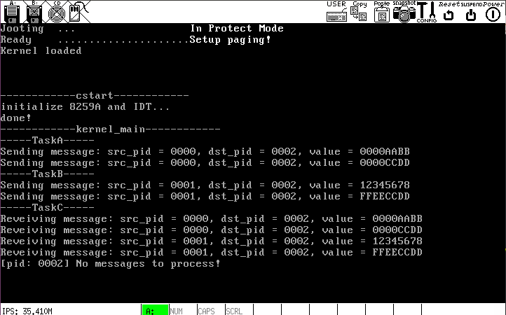