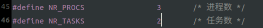
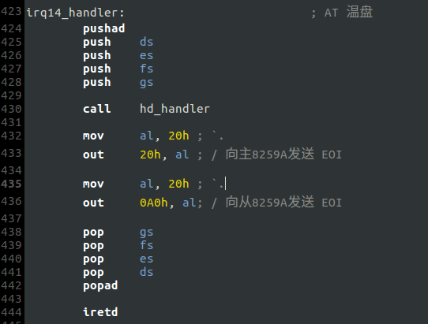
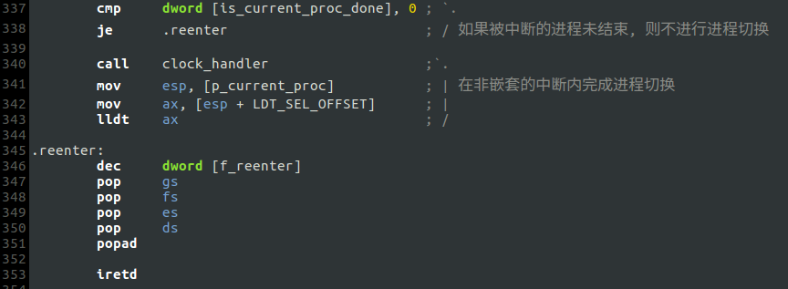
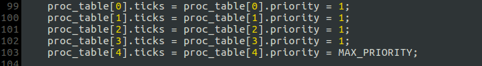
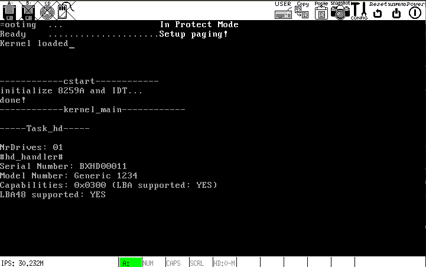

# a. 硬盘驱动程序

## 添加任务`Task_hd`
### <1> `NR_TASKS`加一 (include/sysconst.h)

### <2> 按照`3/f/README.md`完成剩下的步骤

## 准备硬盘中断例程
* `kernel/kernel.asm` -- `irq14_handler`

* `kernel/hd.c` -- `hd_handler`

## 改进进程调度模块
之前的进程调度存在的问题: 如果当前进程被中断，则时钟中断例程返回后，程序将从`p_current_proc`指向的地方开始执行，而不是从当前进程被中断的地方继续执行. 因此必须让时钟中断例程知道当前被中断的进程是否已经结束，若已结束则修改`p_current_proc`完成进程切换，否则返回到进程被中断的地方继续执行.

- 在`kernel/main.c`里使用全局变量`is_current_proc_done`，若`is_current_proc_done = 1`则表明进程已结束，可以切换到下一个进程.
- 初始化`is_current_proc_done`: (--kernel_main)

- 修改时钟中断例程，判断当前进程是否结束

- 本例只希望看到`Task_hd`的输出，需要在三个进程入口处添加如下代码:

- 修改优先级: (--kernel_main)

## 硬盘驱动的实现
`kernel/hd.c` & `include/hd.h`

## 运行结果
