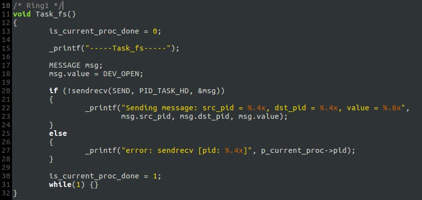
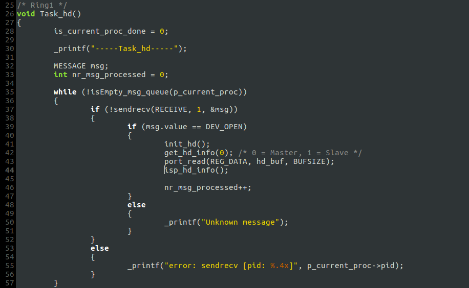
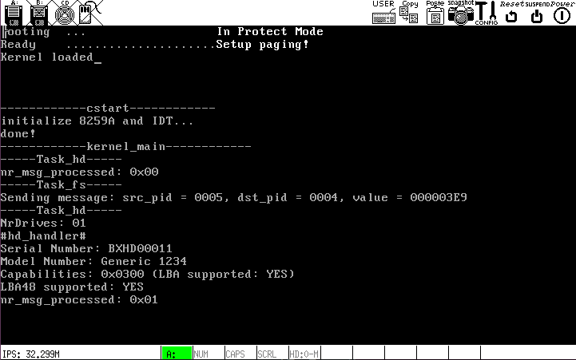

# b. 文件系统进程`Task_fs`与硬盘驱动`Task_hd`通信

### 添加`Task_fs`
`fs/fs_main.c`

### 修改`Task_hd`

### 全部进程的优先级设置:

### `Task_fs`和`Task_hd`的通信机制
- `Task_hd`循环处理消息队列里的消息，直到队列为空；当`Task_hd`的消息循环结束后，如果有`DEV_OPEN`消息被处理则进入无限循环，不再接收调度(进程切换停止).
- `Task_fs`向`Task_hd`发送消息`DEV_OPEN`，`Task_hd`当且仅当接收到`DEV_OPEN`消息才打印硬盘参数.
- 二者的协同运转依赖进程调度模块的进程切换动作.

### 运行结果
