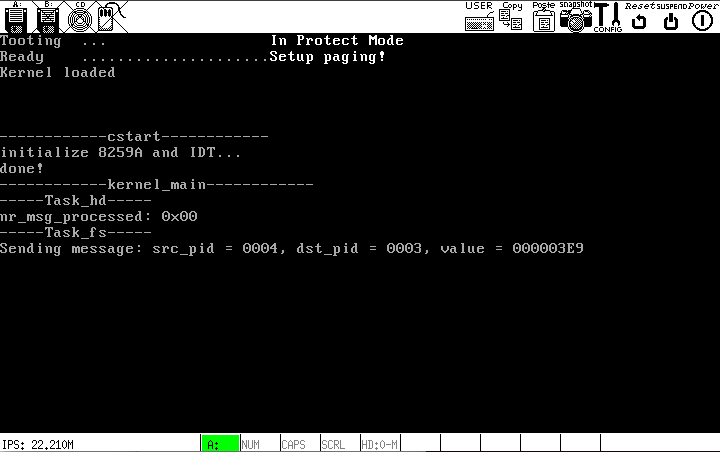
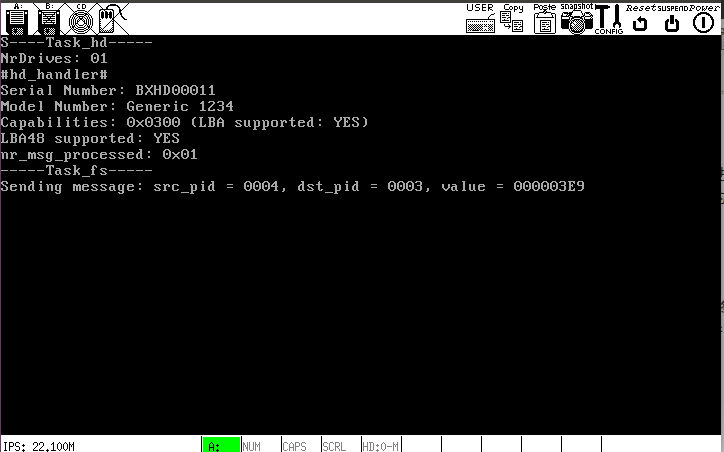
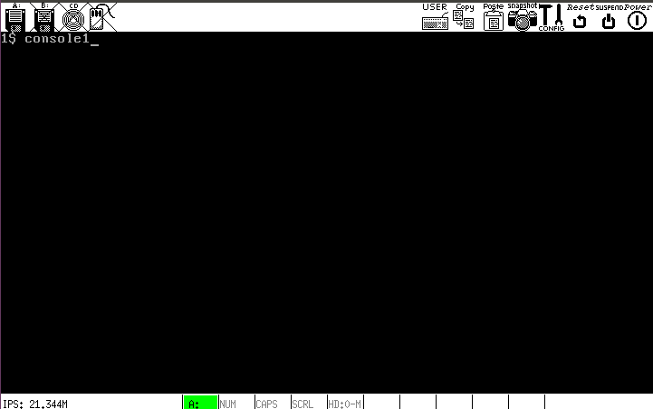

# c. 继续文件系统之前，我决定尽可能完善操作系统的用户交互接口

## 完善用户接口包括以下方面:
- 正确设置光标，使其追随`_printf`打印的字符 (今后将不再在用户进程中使用其他打印函数)
- 完善键盘处理，根据需要实现`Esc`、`Backspace`以及`Fn`的功能
- 多控制台切换

## 整体设计
- 操作系统的 32KB 显存分配给 4 个控制台，编号 0~3:
    - **0号控制台** 用于显示各种进程的输出，仅响应`Esc`(结束终端任务，恢复进程调度)和`Fn`(切换控制台)
    - **1~3号控制台** 显示用户的键盘输入，仅显示可打印字符，并实现`Backspace`

## 代码细节
- `除以/乘以 2` 全部用 `右移/左移 1 位` 来替代
- 其余详见注释

## 操作演示
- 开机启动

`Task_fs`已发送消息给`Task_hd`，但由于`Task_tty`未结束，进程调度被挂起

- 在 0 号控制台按键`Esc`恢复进程调度，则`Task_hd`会收到消息并做出响应

- 在任意控制台使用`Fn`切换控制台

