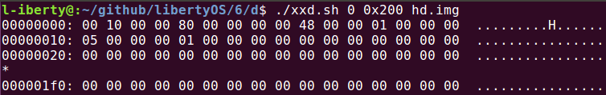
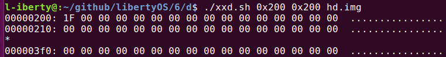
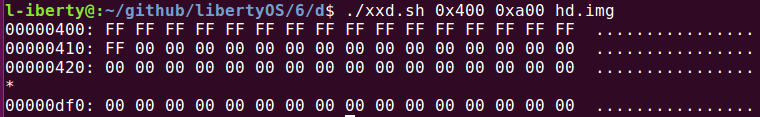
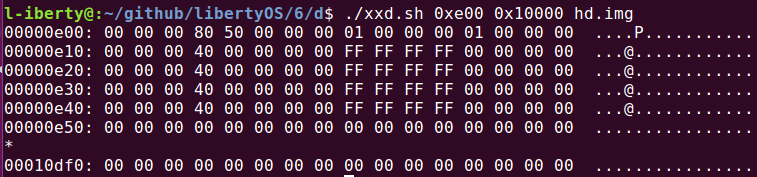
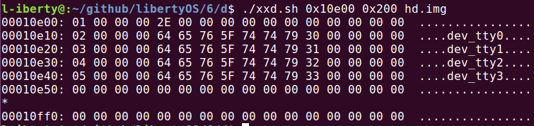

# d. 编码创建文件系统
文件系统各部分数据结构在硬盘上的顺序与书中一致，Super Block 里一些次要数据被省略. 对于书中大费周章的硬盘分区、设备号等内容，我全部略去，而将文件系统的数据结构直接从第 0 扇区开始放入未分区的硬盘. 数据结构的排布如下:

- `super block` 1个扇区

- `inode map` 1个扇区 (即最多映射 512*8 个 inode)

- `sector map` 5个扇区 (该数值需要根据硬盘大小计算得到)

- `inode array` 16*8个扇区

- `根目录文件(由`DIR_ENTRY`数组构成)` 1个扇区

## 写硬盘的流程
文件系统进程将参数放入 `MESSAGE` 结构，将消息发送给硬盘驱动，由硬盘驱动完成写入.