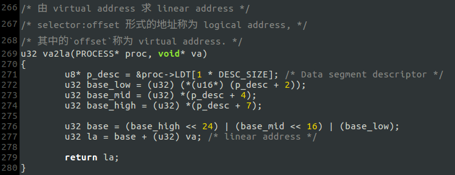
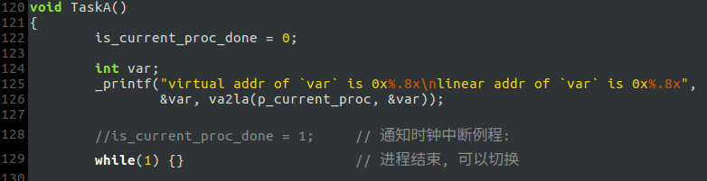
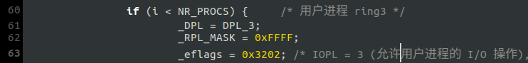

# e. 添加一些函数

## <1> `va2la`
### 函数声明(`include/proc.h`)及实现(`kernel/main.c`)

### 在`TaskA`里测试

测试时发现`_printf`导致`#GP`，原因是`_printf`设置光标的端口I/O操作被阻止，需要修改`IOPL`:

### 运行结果

> 本来想实现`va2pa`(由虚拟地址求物理地址)，但在分页机制下这是无法做到的，因为与页目录和页表有关的地址参数是*物理地址*，地址转换工作由CPU完成，如果要访问页目录和页表就必须使用物理地址进行寻址，而我怎么可能在分页机制下使用物理地址寻址?

