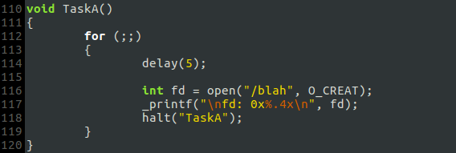
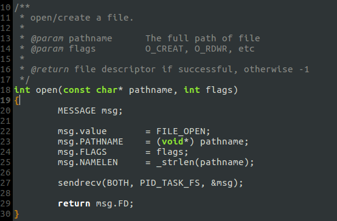
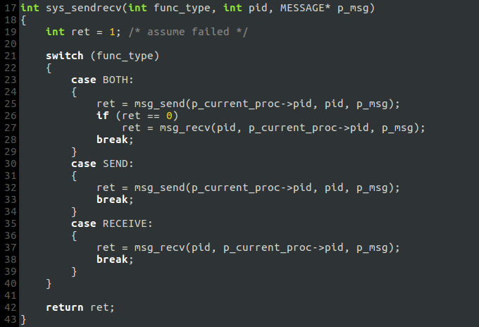
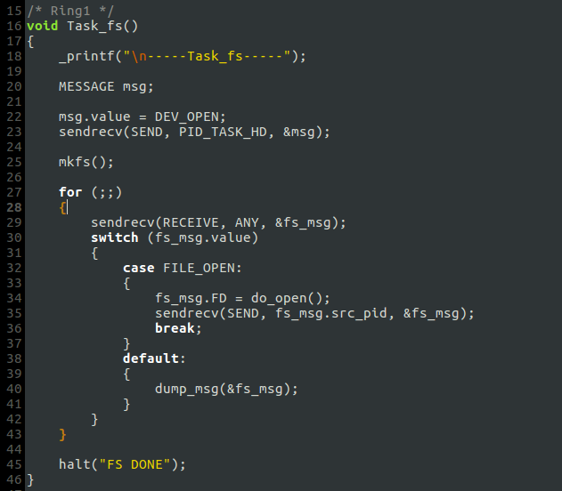
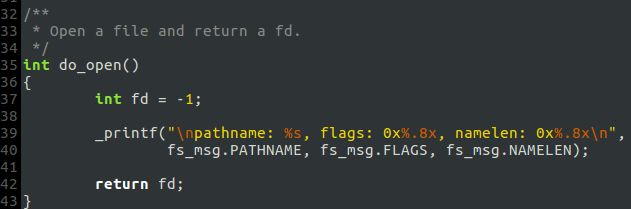
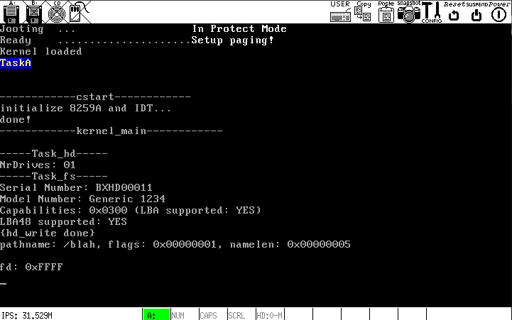

# e. `open()`的框架

### 任意进程调用`open()`

### `open()`实现 (`fs/open.c`)

`open()`将相关参数放进`msg`，并向`task_fs`发送`FILE_OPEN`消息.

此处新增了一种`func_type`: `BOTH`，其处理机制为:

即: 先发送，如果发送成功再接收.

### `task_fs`处理`FILE_OPEN`消息

`task_fs`调用`do_open()`处理`FILE_OPEN`消息，将`do_open()`返回的`fd`放进`fs_msg`后，将消息回馈给消息的发送方--`open()`的调用者.

### `do_open()`实现 (`fs/open.c`)
`do_open`将实现*打开/创建文件*的核心功能，在框架构建阶段先简单一些：仅打印相关参数:

### 运行测试：框架各元素工作正常，IPC模块运行正常
      
