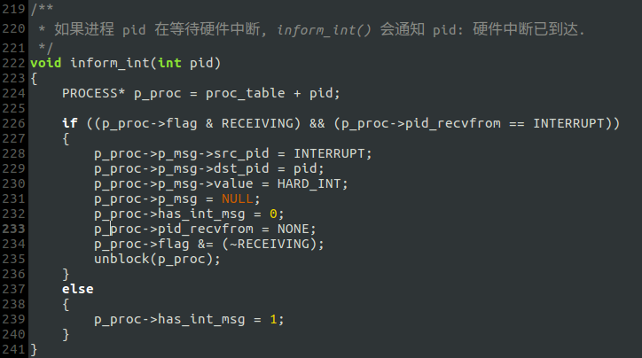
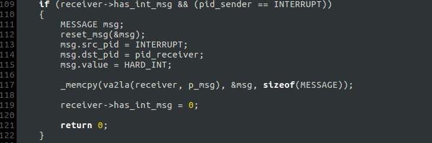
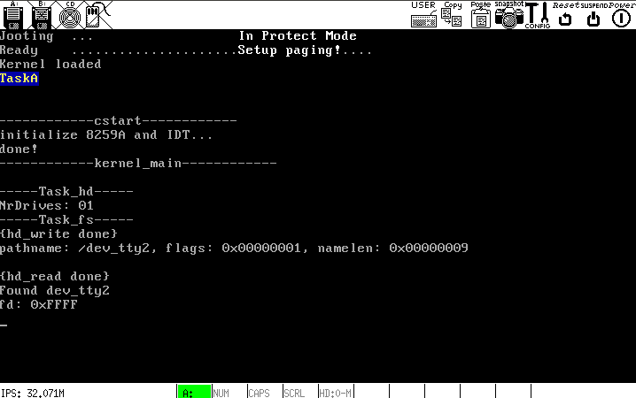

# f. 改进`IPC`模块
目前的进程通信模块总是存在问题，当引进一项新功能时可能就会发现原先的BUG. 由于`do_open()`需要读取硬盘数据，就涉及`task_fs`、`task_hd`和硬盘中断的协同运转，但之前的`IPC`并未考虑硬件中断的参与.

## 修改:
### 添加`inform_int()`和`interrrupt_wait()` (`kernel/proc.c`)
- `inform_int()`

- `interrupt_wait()`

### 在`msg_recv`内添加对硬件中断信号的处理

此外，在使用`_memcpy`拷贝消息时使用了`va2la`进行地址转换，显然之前并未考虑到进程地址空间相互隔离的问题.

## 分析:
- `find_file`(`fs/misc.c`)调用`read_hd`(`fs/fs_main.c`)读取硬盘数据
- `read_hd`向硬盘驱动程序发送并接收消息
- 硬盘驱动接收到文件系统进程的消息后，调用`hd_read`
- `hd_read`调用`hd_cmd_out`发送硬盘命令后，调用`interrupt_wait`接收硬件中断信号，硬盘驱动被阻塞
- 硬盘中断发生，`hd_handler`通知硬盘驱动，硬盘驱动被解除阻塞
- `port_read`返回后`hd_read`结束
- 硬盘驱动向文件系统进程回复消息，`read_hd`接收消息，文件系统进程被解除阻塞
- `read_hd`拿到硬盘数据后返回.

**读入硬盘数据后，查找文件就很容易了. 下图是`do_open()`中对`find_file()`的测试:**

