# g. 初步实现`open()`

## 一、创建一个文件的步骤:
1. 在 inode_map 中分配一位 - `alloc_imap_bit()`
2. 在 sector_map 中分配多位, 从而为文件数据分配扇区 - `alloc_smap_bits()`
3. 在 inode_array 中创建一个 inode - `alloc_inode()`
4. 在 root dir 中创建一个目录项 - `alloc_dir_entry()`

## 二、测试代码
- `TaskA`创建两个文件:

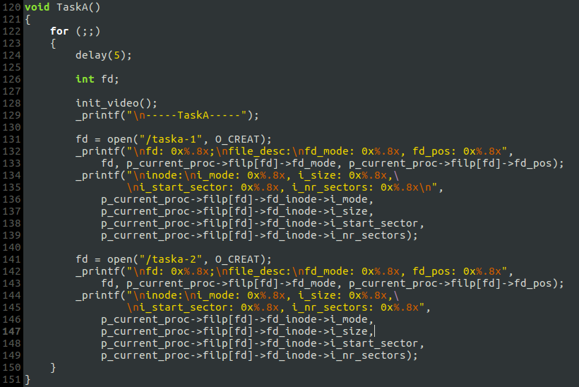

- `TaskC`用`O_RDWR`标志打开`TaskA`创建的第二个文件

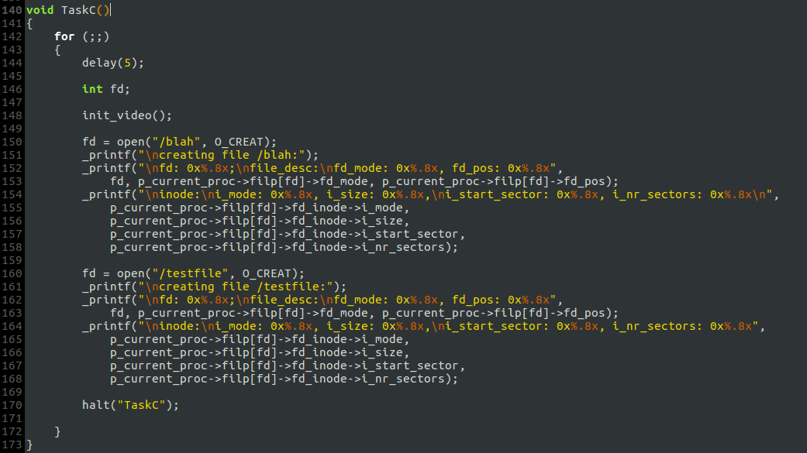

## 三、测试结果
### 输出:
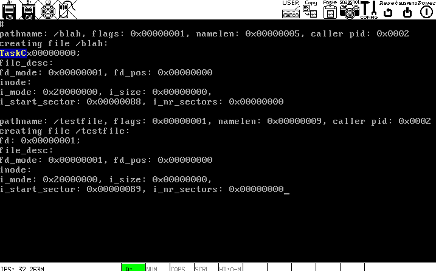

### 硬盘映像:
#### 初始硬盘映像如下
- `inode_map`

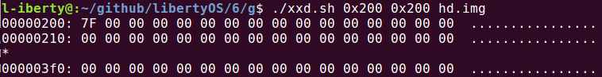

- `sector_map`

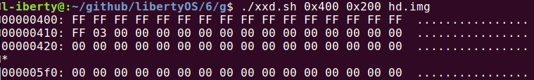

- `inode_array`

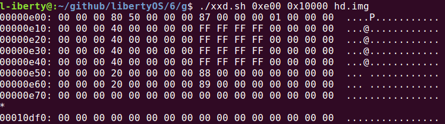

- `root_dir`

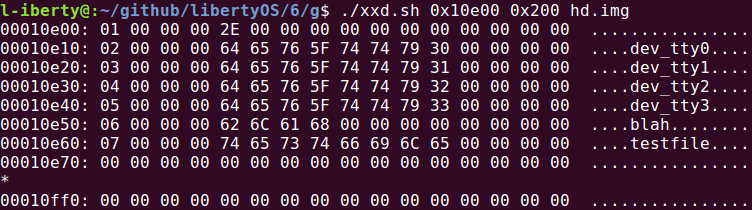

#### 运行后的硬盘映像如下:
- `inode_map`

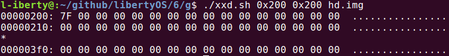

- `sector_map`

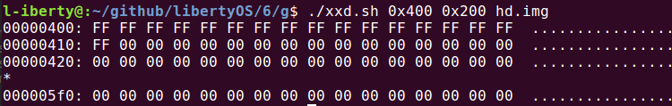

- `inode_array`

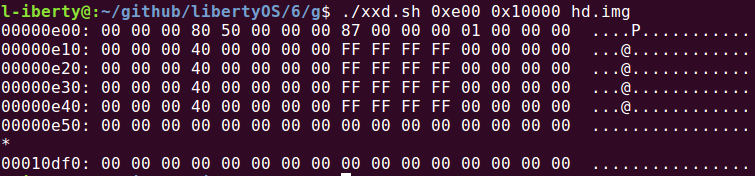

- `root_dir`

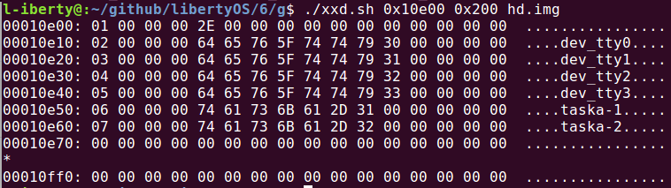

### 对比后发现，`open()`对文件系统各部分数据结构的操作暂时是正确的. 以下是几点说明:
- 第一个创建的文件`/taska-1`的`inode`结构里的`i_start_sector`(文件数据所在的第一个扇区号)为`0x88`，该扇区紧随根目录占据的那个扇区. `include/fs.h`定义了常量`FIRST_SECTOR`，其值即为`0x88`.
- `open()`创建文件后，新文件大小为 0 字节，故将`i_size`设为 0, 但需需要为文件数据预留`NR_DEFAULT_FILE_SECS`个扇区.

## 四、`open()`的整个过程
- 进程A调用`open()`
- `open()`将参数放进消息结构体，向`task_fs`发送`FILE_OPEN`消息后等待回复
- `task_fs`在主循环中接收到`FILE_OPEN`消息后调用`do_open()`
- `do_open()`最终返回`fd`，`task_fs`将`fd`放进消息结构体后，向进程A回复消息
- 进程A收到`task_fs`的回复
- `open()`返回`fd`，进程A结束`open()`调用

## 五、More
打开设备如何处理？尚未实现.
