# i. 测试文件读写

## 测试内容:
### 一、写文件
**`TaskA`:**

- test-1: 创建新文件，一次性写入超过 2 扇区数据
- test-2: 创建新文件，逐字节写入超过 2 扇区数据
- test-3: 打开已存在的、有数据的文件，移动文件指针后写入数据，写入长度超过原文件末尾

#### 1.`test-1`和`test-2`:
- 测试代码

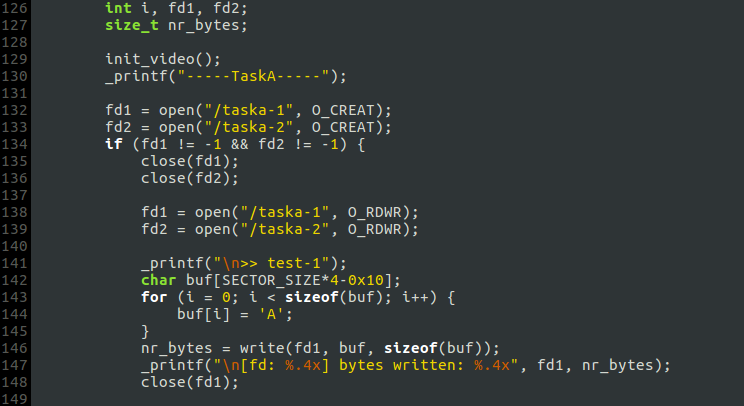

- 输出:

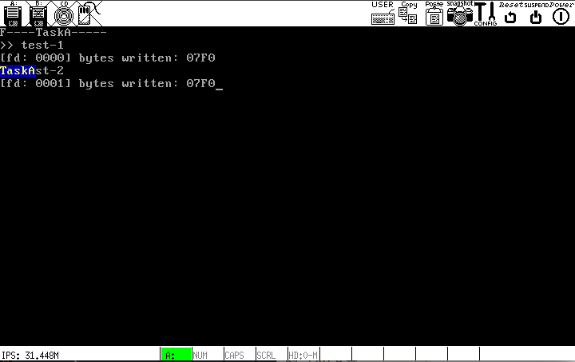

`write()`返回的写入字节数是正确的. 查看硬盘映像:

**inode_array:**

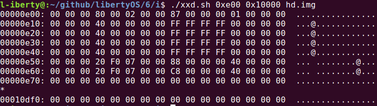

**root_dir:**

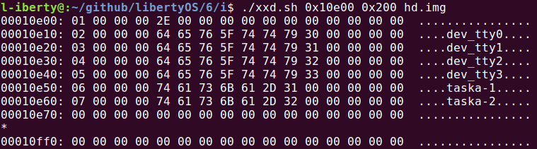

**文件`taska-1`数据扇区(开头和结尾):**

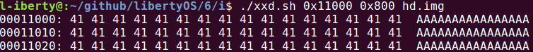

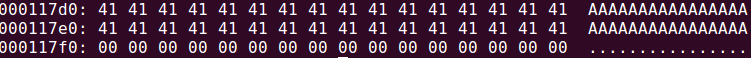

**文件`taska-2`数据扇区(开头和结尾):**

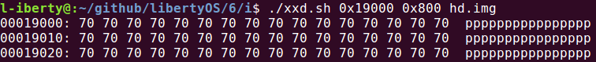

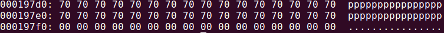

显然，`write()`返回后，文件系统的数据结构和文件数据扇区的内容与期望相符，`test-1`和`test-2`测试通过.

#### 2.创建一个新硬盘，并将上述代码中的注释去掉，测试`test-3`:

- 输出:

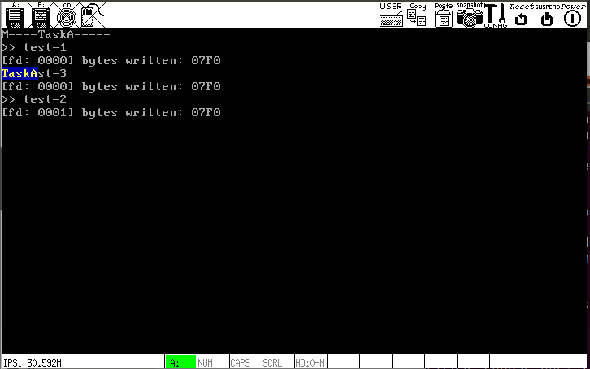

`write()`返回的写入字节数是正确的. 查看硬盘映像:

**inode_array:**

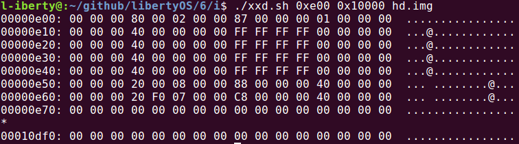

可以看到，`taska-1`的文件大小变为`0x10+0x7F0=0x800`，符合测试代码的运行预期.

**文件`taska-1`数据扇区(开头和结尾):**

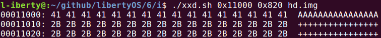

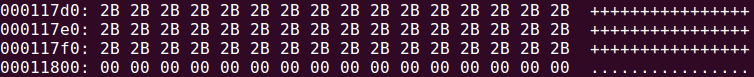

文件数据扇区的内容与期望相符，`test-3`测试通过.

### 二、读文件
**`TaskB`:**

> 测试环境: `TaskA`进行的`test-3`结束后，将`TaskA`主循环内的代码全部注释掉，将`Task_fs`内调用`mkfs()`的代码注释掉，从而在`TaskB`内用`taska-1`或`taska-2`完成测试.

- test-1: 打开并读取文件，读取长度 < 文件大小
- test-2: 打开并读取文件，读取长度 > 文件大小
- test-3: 打开文件，逐字节读取，读取次数 > 文件大小
- test-4: 打开文件，移动文件指针，读取长度 > SECTOR_SIZE

#### 1.test-1:
- 测试代码:

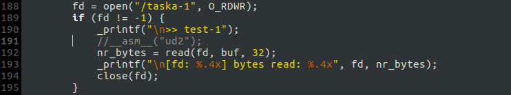

- 输出:

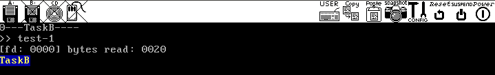

`read()`返回值正确，缓冲区`buf`内容如下:

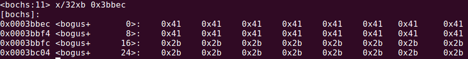

#### 2.test-2:
- 测试代码:

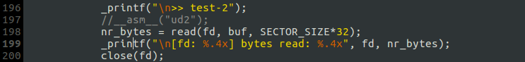

- 输出:

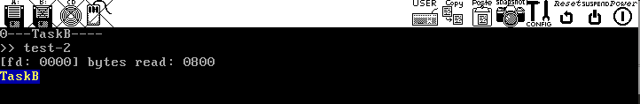

`read()`返回值正确(如果读取长度超过文件大小，多余的部分不被读取)，缓冲区`buf`部分内容如下:

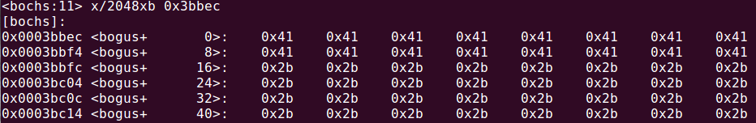

#### 3.test-3:
- 测试代码:

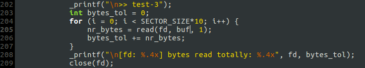

- 输出:

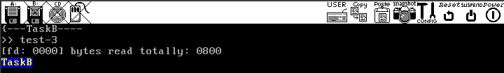

`read()`返回值正确，`buf`的缓冲区内容经查看也是正确的，此处不再截图.

#### 4.test-4:
- 测试代码:

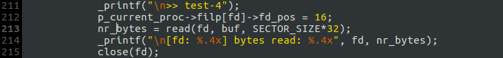

- 输出:

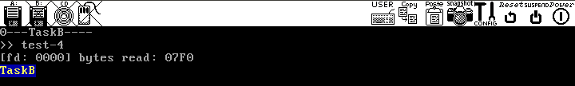

`read()`返回值正确，`buf`的缓冲区末尾部分内容:

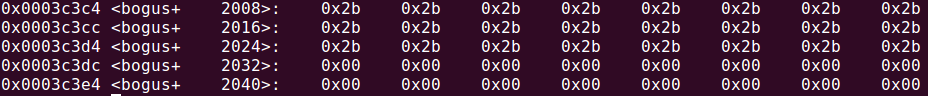

可见，由于仅读取了0x7F0个字节，长度为0x800的缓冲区最后0x10个字节未被填充.

**`TaskB`的4个test全部测试通过.**

## 测试总结
- 读写文件时的数据长度都超过了 2 个扇区，通过这样的极限测试可以发现`do_rdwt()`的细节错误以及`Task_hd`和`Task_fs`的通信BUG，即：有两个地方必须调用`interrupt_wait()`等待硬盘中断:

**hd_read()**

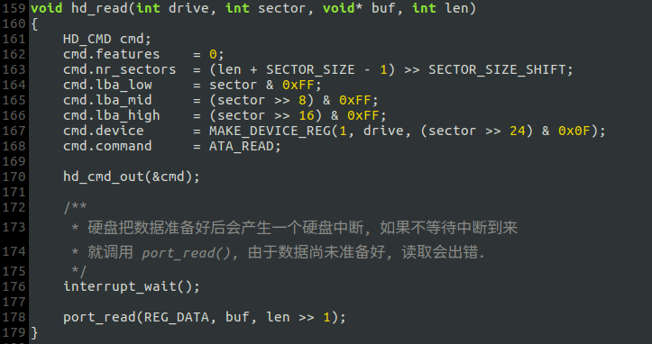

**hd_write()**

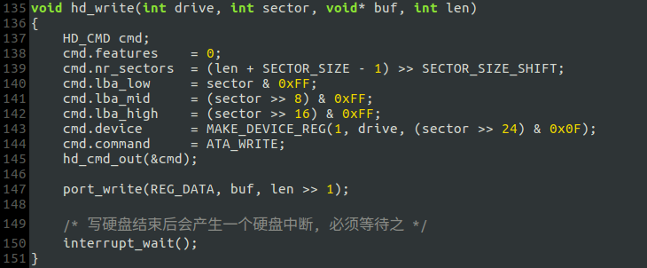

- 原先的进程栈需要扩充，否则分配读写缓冲区时会发生堆栈错误:

- 由于读写长度较长，`Task_hd`和`Task_fs`需要更多的时间片，因此需要为二者指定更高的优先级:

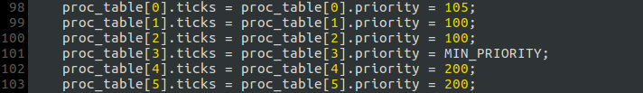

- IPC的时序问题是本次测试过程中最难以调试的BUG，修复时主要靠直觉.