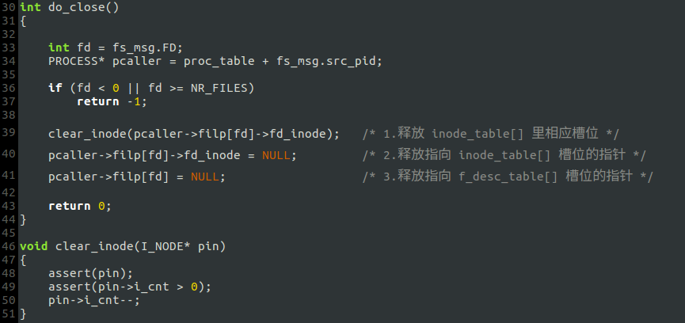
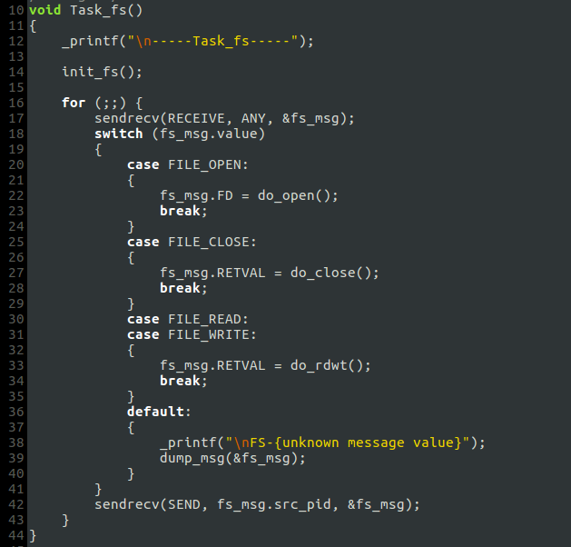
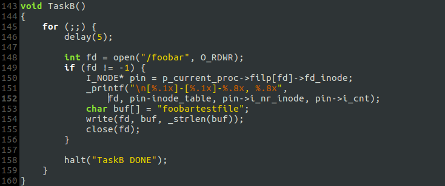

# j. 细节补充与修改

## `I_NODE`结构新成员——`i_cnt`
`i_cnt`表示有多少个进程在使用这个i-node，调用`alloc_inode()`新建i-node时将其置1，调用`get_inode()`时将其加1.

## `get_inode()`
以前调用`get_inode()`时，不论文件是否已被创建，都将在`inode_table[]`里新建一个槽位；现在，只有当创建新文件时才会新建槽位，若文件已被创建，`get_inode()`在`inode_table[]`找到文件的i-node，返回其指针.

## `do_open()`
不允许同一个进程多次打开同一个文件，除非上次打开的同名文件已被关闭.

## `do_close()`

## 统一硬盘驱动和文件系统进程的框架
- `task_hd`

- `task_fs`

## 测试新的文件处理策略
- `TaskA`:

- `TaskB`:

- 运行结果符合预期

