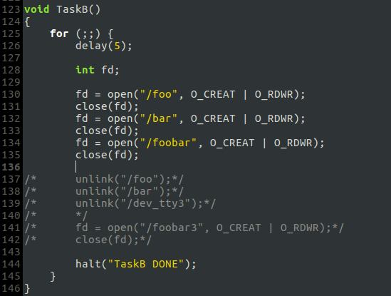
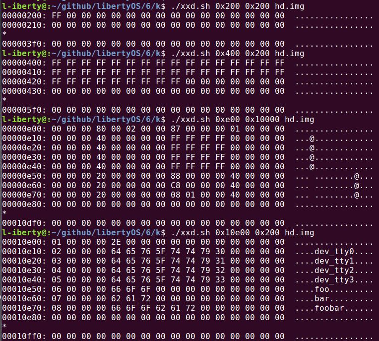
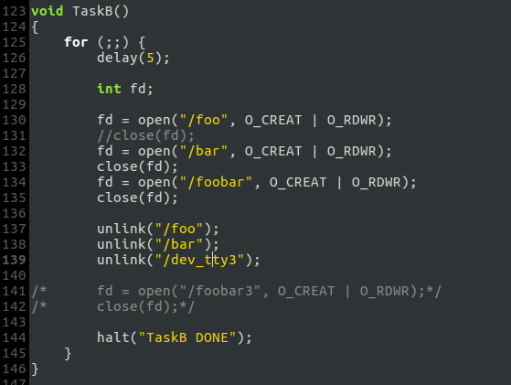
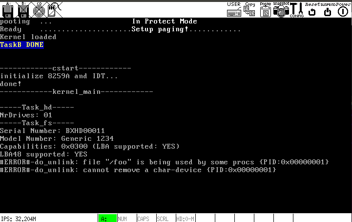
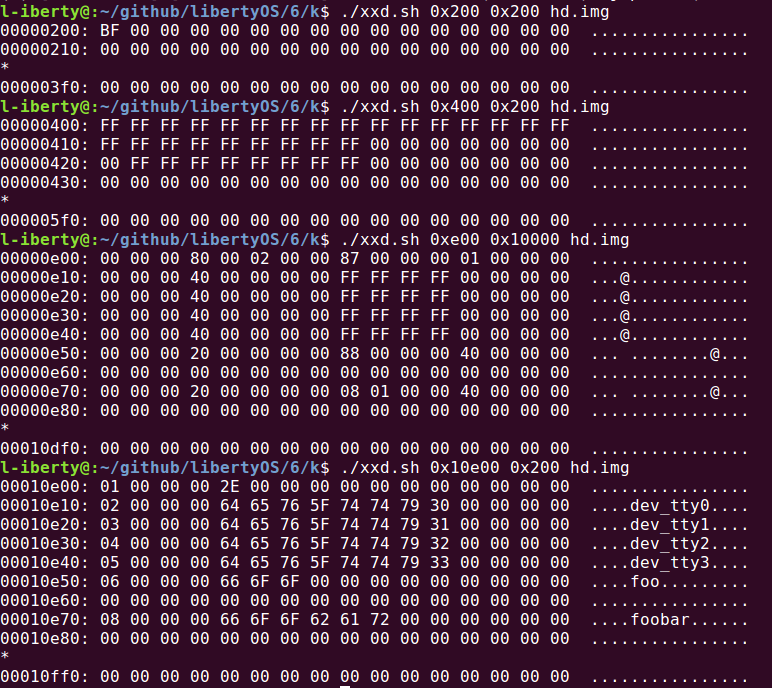
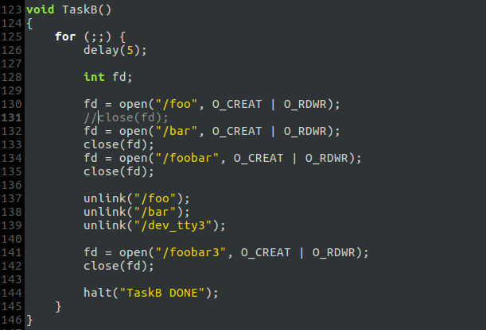
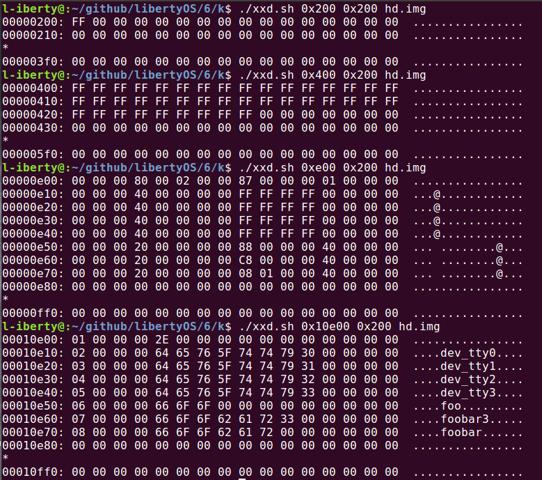

# k. unlink()删除文件

## 删除文件的步骤
1. 内存——将`inode_table[]`中的`i-node`清零
2. 磁盘——释放`inode_map`的相应位
3. 磁盘——释放`sector_map`的相应位
4. 磁盘——将`inode_array`中的`i-node`清零
5. 磁盘——删除根目录中的目录项

### 细节说明
- [unlink()](fs/unlink.c)的实现完全按照上述步骤，但需要先对删除操作的合法性进行检查，比如不允许删除目录文件和字符设备文件.
- 删除文件时，文件的`i_cnt`必须为零，即：如果文件尚未被所有打开它的进程关闭，就不删除之.
- 如果文件能被删除，则对于该文件，`filp[fd]->f_desc_table[]->inode_table[]`的指针连接不存在，且相应的`filp[]`项和`f_desc_table[]`项已被释放，所以在*内存*中只需将相应的`inode_table[]`清零.
- 5个步骤都将在对应的数据结构内生成空洞，空洞将被后续创建新文件时使用.

## 测试
### Test-1
- 创建３个文件

- 硬盘映像 (imap, smap, inode_array, root_dir)

### Test-2
- 删除测试

- 输出

`/foo`未关闭，所以无法删除；`/dev_tty3`是字符设备文件，不允许删除.

- 硬盘映像 (imap, smap, inode_array, root_dir)

显然，`/bar`文件删除后各部分出现了空洞.

### Test-1
- 删除测试完成后，新建一个文件

- 硬盘映像 (imap, smap, inode_array, root_dir)

`/foobar`被填进了空洞.

## 总结
至此，`open()`,`read()`,`write()`和`unlink()`基本实现，文件系统的基本操作业已完成. 这些函数的实现框架一致，为便于今后扩展，现予以概括:

- 在`include/proc.h`中定义一种消息: `FILE_XXX`;
- 实现消息处理函数`do_xxx()｀；
- 在`Task_fs`的主循环内调用`do_xxx()`消息处理;
- 实现用户接口函数`xxx()`，用于将`FILE_XXX`消息和其他参数发送给`Task_fs`.

