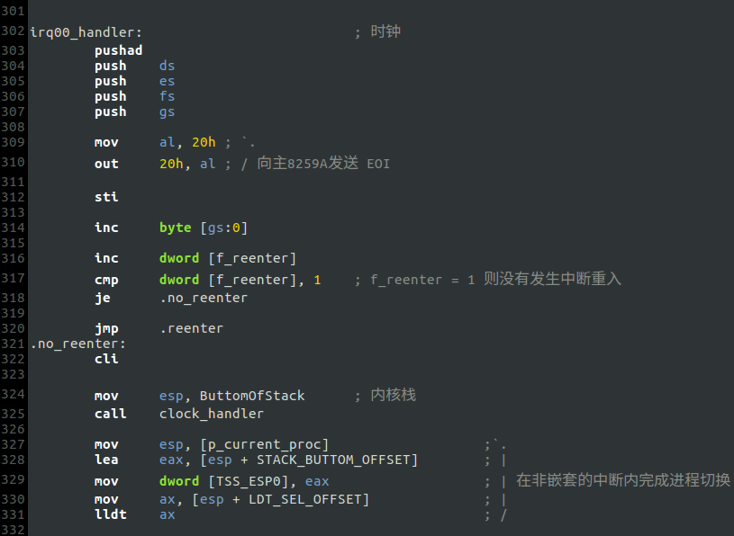
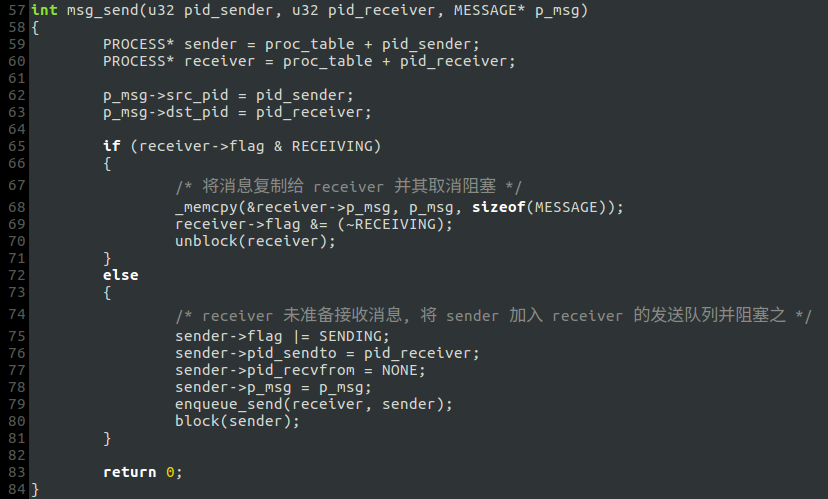
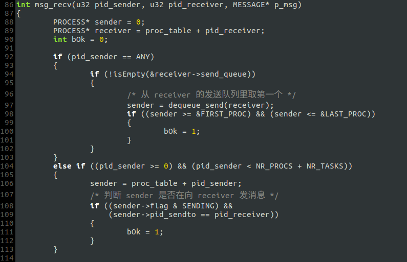
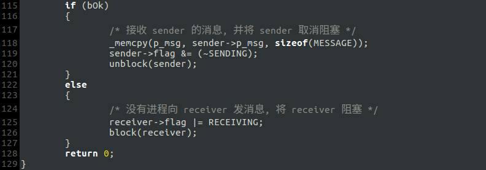
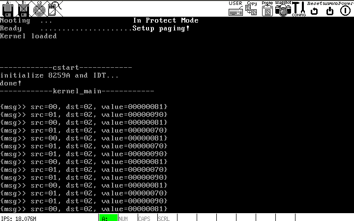

# 重构

## 1.进程调度
之前的进程调度属于*非抢占式调度*，并没有发挥时钟中断的作用. 事实上，以前的进程调度是这样的: 如果进程 A 被中断，则切换到进程 B (A 和 B 可以相同)，从进程 B 的**开头**开始执行. 即，一个进程被中断后就无法从被中断处恢复运行，进程的状态不存在"挂起"和"唤醒"，只有"重启"和"终止". 为了解决这一问题，我引入了`is_current_proc_done`变量来标记一个进程是否已经运行结束(是否可被调度)，如果进程尚未运行结束，时钟中断不会进行进程的调度或切换，因此这是"非抢占式调度". 问题的关键在于我根本没有让进程表的`STACK_FRAME`结构(以下简称为进程的扩展栈)发挥其保存进程的 CPU 环境变量的功能，因为每次中断(不止是时钟)发生时，CPU 从`TSS`里取得的`SS:ESP`始终指向内核栈，那么中断例程入口处的`push`对应的并不是进程的扩展栈，也就是说，被中断进程的 CPU 环境变量被保存到了内核栈; 而每个进程的扩展栈里的内容一直是`kernel_main`里初始化的数值! 下图是修改后的时钟中断例程(暂定):

对于首次被中断的进程，它的 CPU 环境变量还是被放到了内核栈，但随后便将`TSS.ESP0`设置为下一次堆栈切换时应使用的值(ring0, ring1, ring3的`SS`指向的描述符所对应的内存段的线性基地址都为0)，即新的进程的扩展栈栈底，使得下一次发生中断时进程的 CPU 环境变量能够保存自己的扩展栈里. 例如: `TaskA`首次启动后运行到 a 点便发生时钟中断，a 点的环境变量被保存到内核栈，若经调度后`p_current_proc`依然指向`TaskA`，则`TSS.ESP0`被设置为`TaskA`的扩展栈栈底，调度结束后`TaskA`被重启(`TaskA`的扩展栈的内容仍为初始值)，如果在 b 点发生时钟中断，b 点的环境变量就会被保存到扩展栈里，在后续的调度中如果`p_current_proc`指向了`TaskA`，则`TaskA`将被从 b 点唤醒而不是重启. 可见，进程刚启动时短期内运行不稳定，当`TSS.ESP0`被设置后才趋于平稳，所以好的做法是在进程开头使用`delay()`延时.

**需要说明的是，中断例程中的堆栈切换操作应被所有中断例程采用，并在结尾处根据`p_current_proc`重新加载 LDTR**

## 2.进程通信
之前设计的*基于消息队列的IPC*是为了适应那个错误的进程调度而生的，现应将其改为*基于消息机制的同步IPC*. 于的代码实属复杂，我将其简化为如下:

### `msg_send()`

- 进程 A 给进程 B 发消息的过程:
    - A 准备好消息体 m；
    - 如果 B 正在准备接收消息，则将 m 复制给 B, 并将 B 取消阻塞；
    - 如果 B 未准备接收消息，则将 A 加入到 B 的发送队列中，并将 A 标记为`SENDING`从而阻塞之.

### `msg_recv()`

- 进程 A 接收消息的过程
    - A 准备好消息体 m，用于接收消息;
    - 如果 A 想接收来自任意进程的消息，则从 A 的发送队列里取第一个，将其消息复制给 m；如果队列为空，说明没有进程在给 A 发送消息，则将 A 标记为`RECEIVING`，从而阻塞之;
    - 如果 A 想接收来自特定进程 B 的消息：
        - 如果 B 正在向 A 发送消息，则将 B 的消息复制给 A，并将 B 取消阻塞;
        - 如果 B 没有在向 A 发送消息，说明没有进程在给 A 发送消息，则将 A 标记为`RECEIVING`，从而阻塞之.

### 调度算法
[kernel/clock.c](kernel/clock.c.)

如果进程的`flag`不等于0，就没有被执行的机会，"阻塞"便是通过这一点实现的.

**目前仅使用`TaskA`, `TaskB`和`TaskC`进行测试, 进程调度和进程通信暂且能如期工作:**

