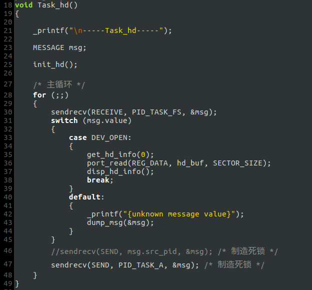
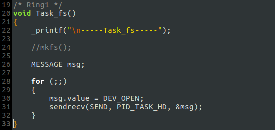
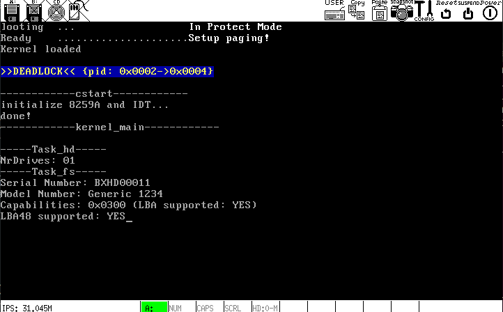

# 重构

## 5. 硬盘驱动和文件系统进程的初步通信
- `task_hd`

- `task_fs`

## 6. 进程通信的修改与补充
- 修复BUG.
- 添加死锁判断函数`deadlock()` (判断消息的发送方是否构成一个环).
- 在`task_hd`末尾，通过制造死锁使系统停机 (消息发送链: A->B->C->HD->A).
- 目前的进程通信暂且能如期运行

**运行结果**

