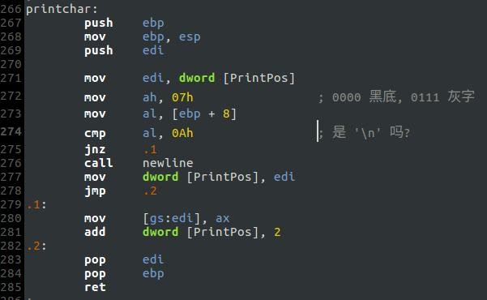
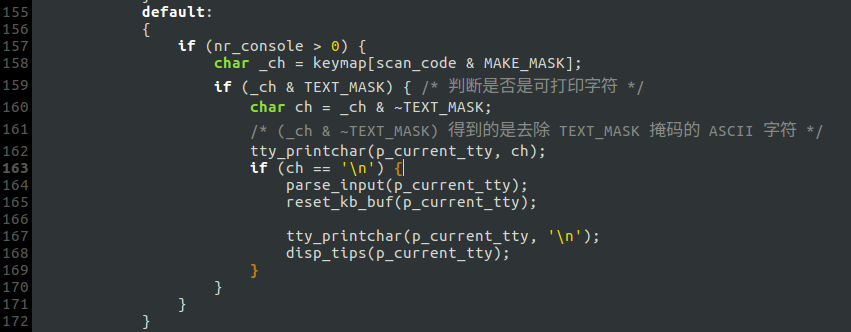
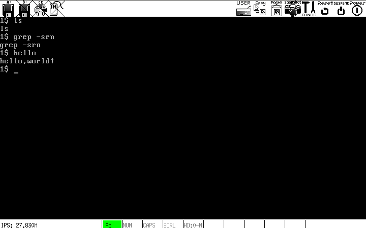

# a.改造TTY
之前的TTY只是单纯的接收键盘输入并回显，甚至连回车换行都没有，现在加以改造.

## 让TTY实现回车换行
只需让`printchar`调用`newline`即可:

## TTY对键盘输入的简单处理
如果输入'\n'，则表明输入完毕，需对本次输入加以解析；解析结束后重置键盘输入缓冲，换行并打印终端提示符，等待下一次输入. 要实现上述功能需要对`kernel/keyboard.c`进行修改:

其中新增的几个函数实现在[kernel/keyboard.c](kernel/keyboard.c)中，此处不再赘述.

## 运行结果

可以看到，输入"hello"后TTY回显了"hello,world!"，对于其他输入则原样返回.
