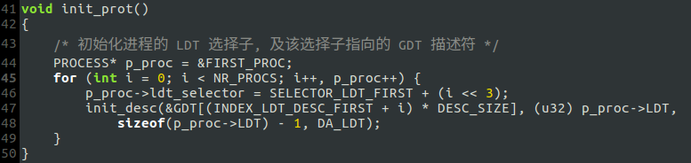
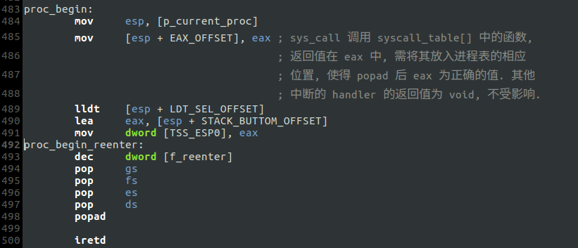
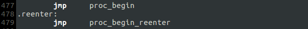
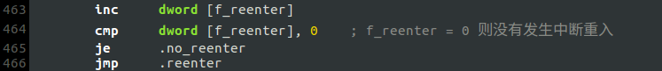
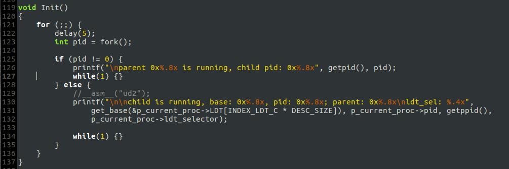
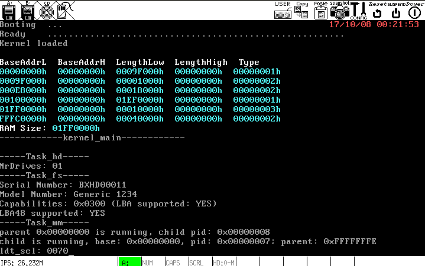
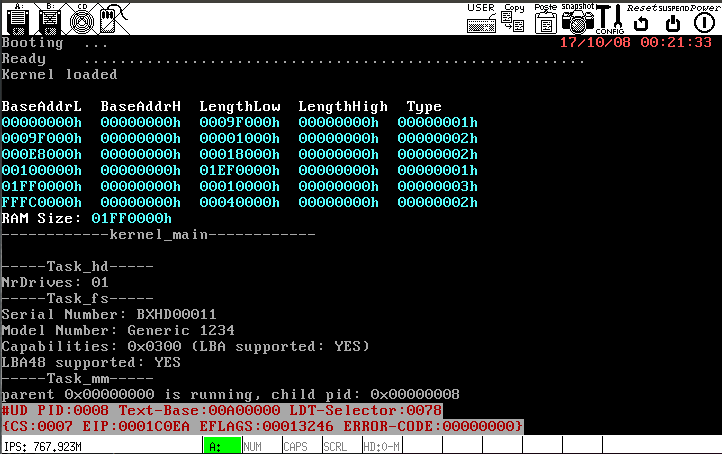

# fork()

## 细枝末节
- 每个进程的LDT描述符(PROCESS::LDT)需要登记在GDT中, 以前只在GDT中留出了16的槽位, 如今已不够用, 需要扩充(include/sysconst.h, kernel/kernel.asm).
- 初始化进程表时，将操作"`初始化进程的 LDT 选择子, 及该选择子指向的 GDT 描述符`"单独放进函数`init_prot()`

- `libertyOS/6/rebuild/part1`提到过一个问题: 第一个进程初启动时不稳定，要解决该问题只需修改`proc_begin`例程:

如此以来，各个中断例程的尾巴均统一为这样:

另外，中断重入的判断条件也要修改:

Last but not least, 进入中断异常处理例程后，需将各个段寄存器修改为内核空间下的值:

- 其他细节上的修改与补充参见注释，不再赘述.

## A bug which I cannot handle
- `Init`进程　& 运行结果:

运行结果显示出一个诡异的事实：`else`模块里应打印`pid`为8的子进程信息，但却是`pid`为7的`Task_mm`.

- 若在`Init`的`else`模块中使用`ud2`引发`#UD`异常，异常处理例程打印的信息为`pid`为8的子进程:

## Tricks
- `ld`添加`-Map kernel.map`参数，将链接信息输出到`kernel.map`，其中包含各个符号的虚拟地址（全局变量的地址和函数的入口地址），调试时可以使用.
