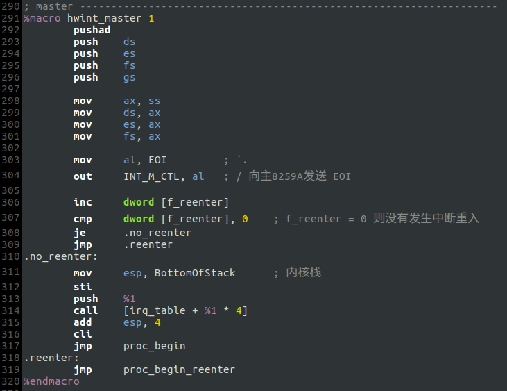
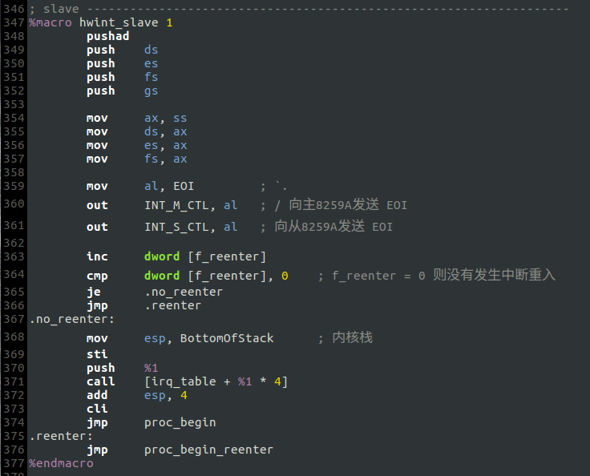
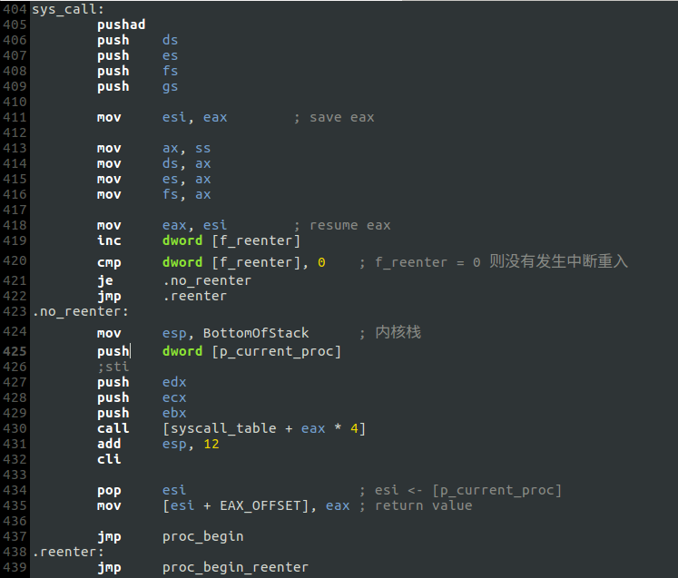

# e. 几点改动

## 参考Orange's的设计，统一了8259A硬件中断例程的代码:

- Master

- Slave

- C语言接口

设计了`irq_table[]`和`put_irq_handler()`等，便于从C语言层次扩展.（详见[include/irq.h](include/irq.h)）

## 中断重入的难题
上述修改完成后，我测试了文件操作，大惊：硬盘驱动调用`hd_read()`读硬盘时，`interrupt_wait()`始终无法返回！而且`libertyOS/7/d`也有同样的问题！跟踪修改记录我发现，系统调用过程的`sti`是BUG的根源，唯有将其注释掉才能解决问题：

经分析，可能是因为`sys_sendrecv()`执行的过程中发生硬盘中断(IRQ=14)，即，系统调用执行过程中发生了其他的中断，那么这个“其他的中断”是不能执行它的中断服务程序的，这是我的设计；而在Orange's模仿Minix的设计中，即使是重入的中断也会执行它的中断服务程序，而且在进入8259A中断例程后，还屏蔽了当前中断，并在中断例程结束时恢复接收当前中断. 但当我添加了Orange's的这两个特性后，执行时系统直接崩溃，屏幕一片灰色.

可以肯定的是，问题一定出在**中断重入**上，但暂时还无法准确定位.
