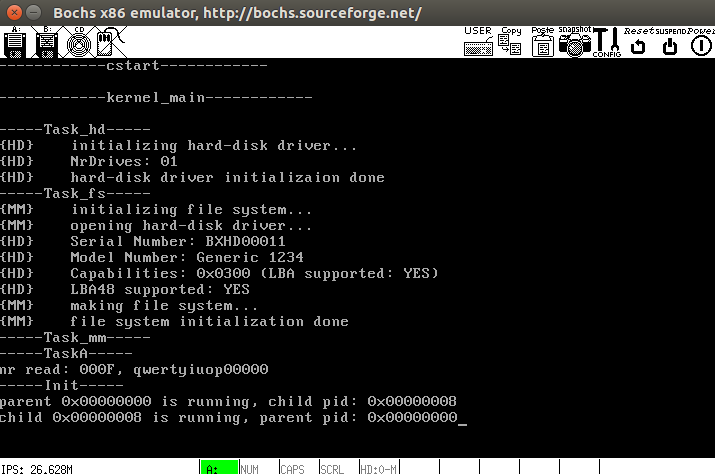

# 对中断服务程序的改进
之前的设计中，重入的中断无法执行其具体的服务例程，使得系统经常因键盘操作得不到相应而卡机.

## 8259A-master
```
; master -------------------------------------------------------------------
%macro hwint_master 1
	pushad
	push	ds
	push	es
	push	fs
	push	gs
	
	mov	ax, ss
	mov	ds, ax
	mov	es, ax
	mov	fs, ax
	
	in	al, INT_M_CTLMASK	; `. 屏蔽当前中断
	or	al, (1 << %1)		;  | out_byte(INT_M_CTLMASK,
	out	INT_M_CTLMASK, al	; /	in_byte(INT_M_CTLMASK) | (1 << %1));
	
	mov	al, EOI			; `.
	out	INT_M_CTL, al		; / 向主8259A发送 EOI
	
	inc	dword [f_reenter]
	cmp	dword [f_reenter], 0	; f_reenter = 0 则没有发生中断重入
	jne	.reenter
	mov	esp, BottomOfStack	; 中断重入未发生, 切换到内核栈
	push	proc_begin
	jmp	.no_reenter
.reenter:
	push	proc_begin_reenter
.no_reenter:
	sti
	push	%1
	call	[irq_table + %1 * 4]
	add	esp, 4
	cli
	in	al, INT_M_CTLMASK	; `. 恢复接收当前中断
	and	al, ~(1 << %1)		;  | out_byte(INT_M_CTLMASK,
	out	INT_M_CTLMASK, al	; /	in_byte(INT_M_CTLMASK) & ~(1 << %1));
	ret
%endmacro
```

## 8259A-slave
```
; slave -------------------------------------------------------------------
%macro hwint_slave 1
	pushad
	push	ds
	push	es
	push	fs
	push	gs
	
	mov	ax, ss
	mov	ds, ax
	mov	es, ax
	mov	fs, ax
	
	in	al, INT_S_CTLMASK	; `. 屏蔽当前中断
	or	al, (1 << (%1 - 8))	;  | out_byte(INT_S_CTLMASK,
	out	INT_S_CTLMASK, al	; /	in_byte(INT_S_CTLMASK) | (1 << (%1 - 8)));
	
	mov	al, EOI 	; `.
	out	INT_M_CTL, al	; / 向主8259A发送 EOI
	out	INT_S_CTL, al	; 向从8259A发送 EOI
	
	inc	dword [f_reenter]
	cmp	dword [f_reenter], 0	; f_reenter = 0 则没有发生中断重入
	jne	.reenter
	mov	esp, BottomOfStack	; 中断重入未发生, 切换到内核栈
	push	proc_begin
	jmp	.no_reenter
.reenter:
	push	proc_begin_reenter
.no_reenter:
	sti
	push	%1
	call	[irq_table + %1 * 4]
	add	esp, 4
	cli
	in	al, INT_S_CTLMASK	; `. 恢复接收当前中断
	and	al, ~(1 << (%1 - 8))	;  | out_byte(INT_S_CTLMASK,
	out	INT_S_CTLMASK, al	; /	in_byte(INT_S_CTLMASK) & ~(1 << (%1 - 8)));
	ret
%endmacro
```

## system call
```
sys_call:
	pushad
	push	ds
	push	es
	push	fs
	push	gs
	
	mov	esi, eax	; save eax
	
	mov	ax, ss
	mov	ds, ax
	mov	es, ax
	mov	fs, ax
	
	mov	eax, esi	; resume eax
	inc	dword [f_reenter]
	cmp	dword [f_reenter], 0	; f_reenter = 0 则没有发生中断重入
	jne	.reenter
	mov	esp, BottomOfStack	; 中断重入未发生, 切换到内核栈
	push	proc_begin
	push	dword [p_current_proc]
	jmp	.no_reenter
.reenter:				; 中断重入发生时esp处在内核栈, 无需切换
	push	proc_begin_reenter
	push	dword [p_current_proc]
.no_reenter:
	sti
	push	edx
	push	ecx
	push	ebx
	call	[syscall_table + eax * 4]
	add	esp, 12
	cli
	
	pop	esi			; esi <- [p_current_proc]
	mov	[esi + EAX_OFFSET], eax	; return value
	ret
```

## 测试结果正确


而且键盘响应比以前流畅多了.

## 关于进程（任务）切换和`TSS`
下文摘自[这里](http://blog.csdn.net/nodeathphoenix/article/details/39269997)

> 在中断描述符表（IDT）中，除中断门、陷阱门和调用门外，还有一种“任务们”。任务门中包含有TSS段的选择符。当CPU因中断而穿过一个任务门时，就会将任务门中的段选择符自动装入TR寄存器，使TR指向新的TSS，并完成任务切换。CPU还可以通过JMP或CALL指令实现任务切换，当跳转或调用的目标段（代码段）实际上指向GDT表中的一个TSS描述符项时，就会引起一次任务切换。

> Intel的这种设计确实很周到，也为任务切换提供了一个非常简洁的机制。但是，由于i386的系统结构基本上是CISC的，通过JMP指令或CALL（或中断）完成任务的过程实际上是“复杂指令”的执行过程，其执行过程长达300多个CPU周期（一个POP指令占12个CPU周期），因此，Linux内核并不完全使用i386CPU提供的任务切换机制。

> 由于i386CPU要求软件设置TR及TSS，Linux内核只不过“走过场”地设置TR及TSS，以满足CPU的要求。但是，内核并不使用任务门，也不使用JMP或CALL指令实施任务切换。内核只是在初始化阶段设置TR，使之指向一个TSS，从此以后再不改变TR的内容了。也就是说，每个CPU（如果有多个CPU）在初始化以后的全部运行过程中永远使用那个初始的TSS。同时，内核也不完全依靠TSS保存每个进程切换时的寄存器副本，而是将这些寄存器副本保存在各个进程自己的内核栈中。

> 这样以来，TSS中的绝大部分内容就失去了原来的意义。那么，当进行任务切换时，怎样自动更换堆栈？我们知道，新任务的内核栈指针（SS0和ESP0）应当取自当前任务的TSS，可是，Linux中并不是每个任务就有一个TSS，而是每个CPU只有一个TSS。Intel原来的意图是让TR的内容（即TSS）随着任务的切换而走马灯似地换，而在Linux内核中却成了只更换TSS中的SS0和ESP0，而不更换TSS本身，也就是根本不更换TR的内容。这是因为，改变TSS中SS0和ESP0所化的开销比通过装入TR以更换一个TSS要小得多。因此，在Linux内核中，TSS并不是属于某个进程的资源，而是全局性的公共资源。在多处理机的情况下，尽管内核中确实有多个TSS，但是每个CPU仍旧只有一个TSS。

在这样的设计模式下，如果要在进程切换的同时切换页表，就需要在进程表中登记该进程的页表信息并手动完成CR3赋值，而不能借助TSS.CR3字段让CPU去做.
