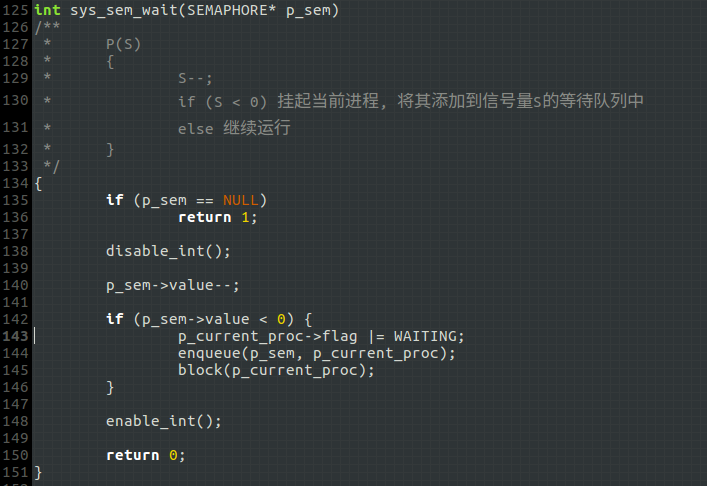
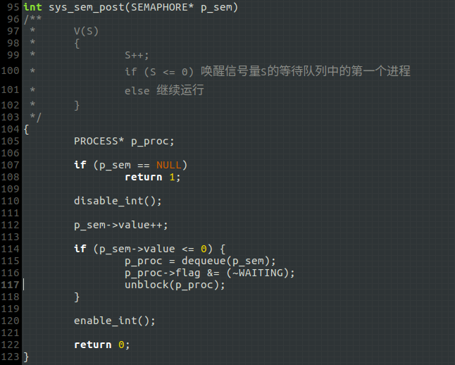
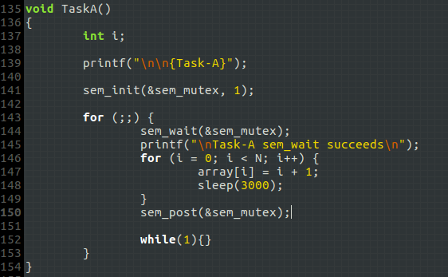
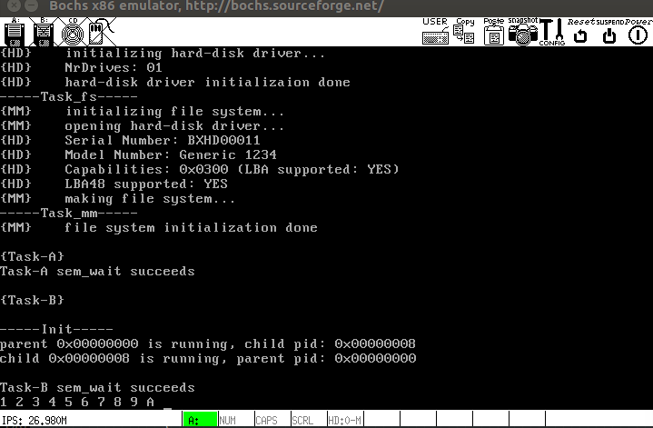
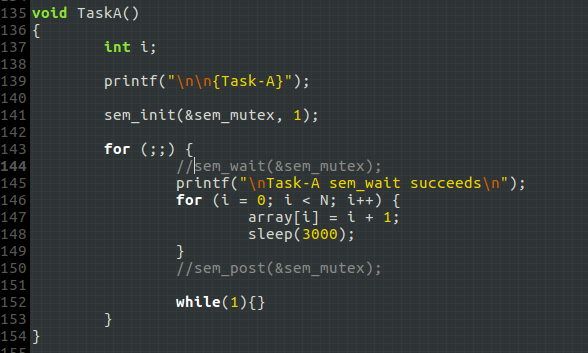
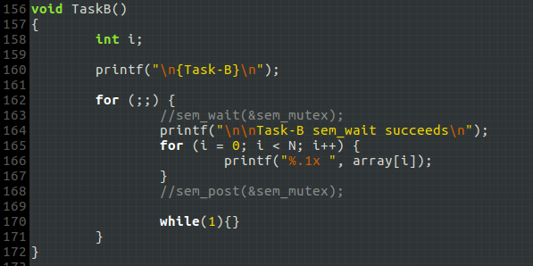
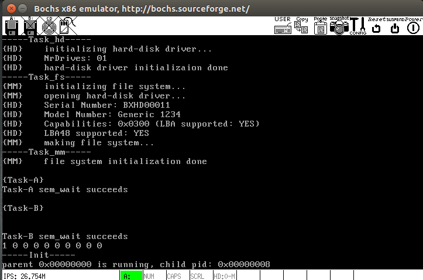

# 实现信号量

## 1. 实现`P`、`V`操作原语:

```
P(S):
	S--;
    if (S < 0) 挂起当前进程，将其添加到信号量S的等待队列中
    else 继续执行
```

```
V(S):
	S++;
    if (S <= 0) 唤醒信号量S的等待队列中的第一个进程
    else 继续执行
```

## 2. 信号量结构体`SEMAPHORE`定义:
信号量的两个必要成员：信号量的值、等待信号量的进程队列：

```
typedef struct {
	int		   value;
	WAIT_QUEUE	wait_queue;
} SEMAPHORE;
```

## 3. 应用层接口
对信号量的操作应实现为*系统调用*，应用层接口包括

1. 初始化 `sem_init()`
2. P操作 `sem_wait()`
3. V操作 `sem_post()`

`P`、`V`操作的内核层函数如下：

`sem_wait()`:



`sem_post()`:



**注意:**

- `P`、`V`操作是*原子操作*，因此需要在操作开始时关中断，避免进程调度，操作结束后再恢复中断.
- 这里为进程新增了一个状态：`WAITING`，由于只有状态标识变量`flag`为0的进程才会被调度，因此无需再修改`schedule()`.

## 4. 测试
### (1) 使用互斥信号量实现对临界资源——全局变量`array[N]`——的互斥访问
`TaskA:`



`TaskB:`


* * *

`TaskA`初始化互斥信号量`sem_mutex`，通过它访问临界资源：向数组`array`赋值. 赋值结束后释放信号量.

`TaskB`则通过互斥信号量读取数组`array`，由于`TaskB`晚于`TaskB`启动，因此，在互斥信号量的协助下`TaskB`应等待`TaskA`完成赋值后再将结果读出；若`TaskA`和`TaskB`交替读写，则`TaskB`的输出会出错.

**下图是`TaskA`和`TaskB`同步的测试结果:**



可以看到，`TaskB`输出的序列为`1 2 ... A`，故正确.

### (2) 对照实验：不使用信号量实现同步互斥
`TaskA:`



`TaskB:`



* * *

**`TaskA`和`TaskB`交替读写`array`，则`TaskB`的输出会出错：**



可以看到，`TaskB`输出的序列**不再**为`1 2 ... A`.