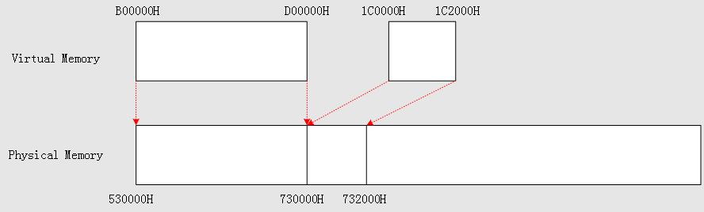
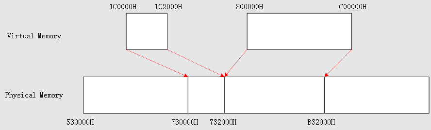
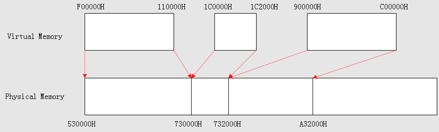
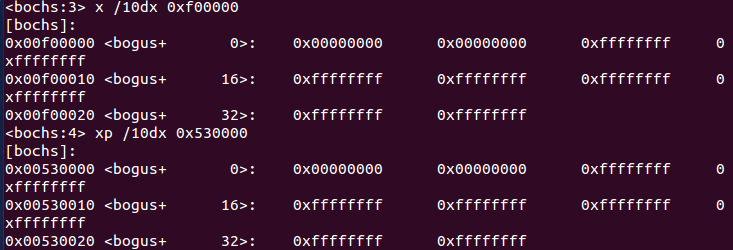
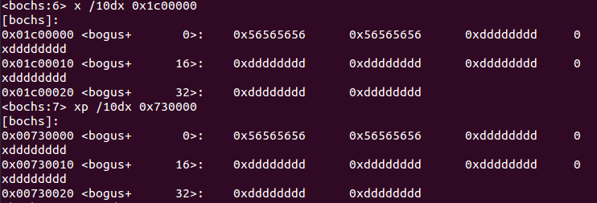
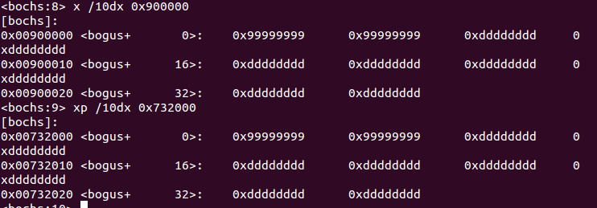

# 内存管理
## 一、物理内存管理 & 页表的建立
### 1. Loader
- `DispMemInfo`打印物理内存信息的同时，记录`ADRS.Type = 1 (AddressRangeMemory)`的内存块的`Base`和`Length`，并确定存放页表的物理基地址;
- 按需建立页表，使用对等映射（线性地址 = 物理地址）但保留存放映射 4G 地址空间的页表所需的内存，详见`SetupPaging`;
- `SaveMemInfo`将`DispMemInfo`记录的物理内存信息保存到虚拟地址`0x8000`，后续由内存管理模块`MM`获取.

### 2. 内存管理模块`MM`的初始化操作`init_mm()`
获取`Loader`保存在虚拟地址`0x8000`的内存信息，并完成内存管理信息的初始化：
- `MM`管理的物理内存是存放页表的那一块;
- 存放二级页表最多需要 4MB + 1KB 内存，这部分内存被保留，紧随其后建立双向循环链表`pf_list`，以页为单位记录内存块的信息：
	- 页框的引用计数——该页框被多少个`PTE`映射
	- 页框的类型:
		- `PAGE_FREE`(空闲的页框，可被分配出去)
		- `PAGE_RESERVED`(被保留的页框，包括存放页表和双向循环链表`pf_list`所占据的页框)
		- `PAGE_MAPPED`(页框已被页表映射)
	- 页框的保护属性——只读、可读写
- 清理页表，将`PAGE_FREE`类型的页框从页表中解除映射, 需要的时候再建立映射.

## 二、虚拟内存分配与释放
### `vm_alloc()`
分配的页框和虚页都是连续的，如果两次分配时给出的线性地址范围有重叠，则第二次分配会失败.

### `vm_free()`
将占位的PDE和PTE清零，并将页框的引用计数减一，如果引用计数为零则讲页框标记为`PAGE_FREE`.

## 三、系统的内存布局
目前的内存布局图：

**页表所实现的地址映射：**
> 使用 Bochs 测试，存放二级页表的物理基地址是`100000H`

| 页表编号 | 页表的物理基地址 | 页表映射的线性地址范围 |
|--------|--------|--------|
| 0 | 101000H | 0 ~ 4M |
| 1 | 102000H | 4M ~ 8M |
| 2 | 103000H | 8M ~ 12M |
| 3 | 104000H | 12M ~ 16M |
| ... | ... | ... |

## 四、测试
测试代码在`kernel/main.c`的`TaskC`里面.

### 结果分析：
#### 1. 分配虚拟内存`11M ~ 13M`
- 线性地址`11M = B00000H`, PDE索引=`2`, PTE索引=`300H`. 所以第一个PTE的物理地址是`103000H + 300H * 4 = 103C000H`, 该PTE对应的页框地址是`530000H`；往后需要填写的PTE个数=`2M / 4K = 512`, 跨越1号和2号页表. 本次分配将线性地址`11M ~ 13M`映射到物理地址`530000H ~ 730000H`, 页表的首尾如下图所示:

使用线性地址和物理地址查看内存：

#### 2. 分配虚拟内存`8M ~ 12M`
此次的线性地址范围与上一次有重叠，分配失败.

#### 3. 分配虚拟内存`28M ~ 28M + 7K` 成功

#### 4. 分配虚拟内存`9M ~ 12M` 失败

#### 经过之前的4次内存分配，虚拟内存和物理内存的映射关系如下：

#### 5. 释放虚拟内存`11~13M`，再分配`8~12M`和`9~12M`
之前分配`8~12M`时，由于与已分配的`11~13M`重叠而失败；释放`11~13M`后，分配`8~12M`便会成功，而分配`9~12M`则会失败：

分配`8~12M`时，从物理地址`530000H`开始没有连续的4M内存，因此只能从`732000H`开始分配.

#### 6. 释放虚拟内存`8~12M`，分配`9~12M`和`15~17M`
释放`8~12M`后，物理地址`732000H`开始的3M内存被映射到虚拟地址`9~12M`；物理地址`530000H~730000H`正好有2M空闲内存可被映射到`15~17M`:

最后内存数据，线性地址`F00000H`,`1C00000H`和`900000H`确实对应与物理地址`530000H`,`730000H`和`732000H`:

**图1**: `F00000H` -> `530000H`

**图2**: `1C00000H` -> `730000H`

**图3**: `900000H` -> `732000H`

## 五、`vm_alloc`的应用——`fork()`
`fork()`为进程分配内存时调用`vm_alloc`

## 六、尾声
此次扩展`MM`模块时发现了进程通信模块的BUG，主要包括`unblock`、`sys_sendrecv`和`msg_send`；另外修改了几个函数接口.
