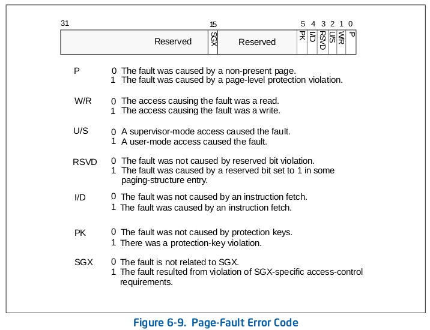

# 虚拟内存管理——`Page Fault`的处理
## 一、`#PF`的产生原因 & 处理策略
### 产生原因
1. 目标页帧不存在（页表项全为0，即该线性地址与物理地址尚未建立映射或者已经撤销)；
2. 不满足访问权限(此时页表项`Present`标志=1，但低权限的程序试图访问高权限的地址空间，或者有程序试图写只读页面);
3. 相应的物理页帧不在内存中（页表项非空，但`Present`标志位=0，比如在swap分区或磁盘文件上).

发生`#PF`时，CPU会把产生异常的线性地址存储在`CR2`中，并且把表示页访问异常错误码保存在中断栈中.

## 对应的处理策略
1. 给未被映射的地址映射上物理页;
2. 直接报错；
3. 执行页面置换.

