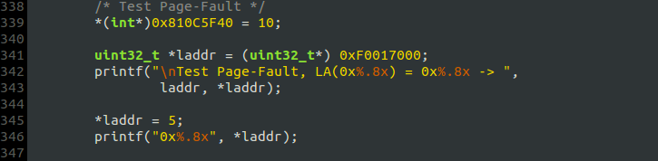
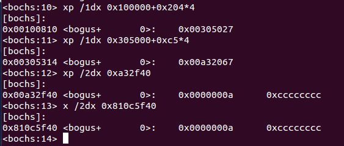
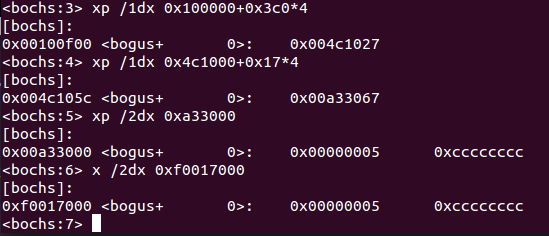
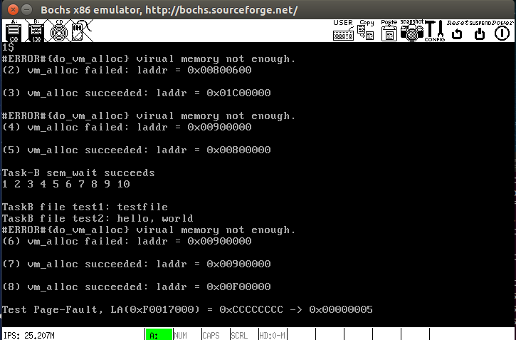

# 虚拟内存管理——`Page Fault`的处理
## 一、`#PF`的产生原因 & 处理策略
### 产生原因
1. 目标页帧不存在（`Present`标志位=0， 且页表项全为0，即该线性地址与物理地址尚未建立映射或者已经撤销)；
2. 相应的物理页帧不在内存中（`Present`标志位=0，但页表项非空，比如在swap分区或磁盘文件上).
3. 不满足访问权限(此时页表项`Present`标志=1，但低权限的程序试图访问高权限的地址空间，或者有程序试图写只读页面);
 
发生`#PF`时，CPU会把产生异常的线性地址存储在`CR2`中，并且把表示页访问异常错误码保存在中断栈中.

## 对应的处理策略
1. 给未被映射的地址映射上物理页;
2. 执行页面置换；
3. 直接报错.

## 二、`kernel/exception.c:do_page_fault()`
- 处理`Page Fault`的主要函数，包含上述3种情形，但遗留了页面置换;
- 给未被映射的地址映射物理页框时，只需从`pf_list`里找到**一个**`PAGE_FREE`类型的页框即可.

## 三、0~19异常（中断）的处理
部分异常发生时，CPU会将`err_code`压栈，因此需要修改`stack_frame`结构，在相应位置添加`err_code`字段, 对于不产生`err_code`的中断，通过`push 0`填充之.

## 四、测试
> 注：在本系统中，虚拟地址=线性地址

**`TaskC`:**

### 1. 向线性地址`0x810C5F40`写入4字节
产生`#PF`异常后, `do_page_fault()`为该线性地址映射一个页框，中断处理结束后，CPU重新执行产生异常的指令. 查看PDE，PTE，并用线性地址和物理地址查看内存：

### 2. 从线性地址`0xF0017000`读出4字节后再写入4字节
根据`do_page_fault()`的处理策略，页面被赋予了写权限，因此写操作不会出错. PDE，PTE，及内存内容如下：

***

**OS的输出**：

