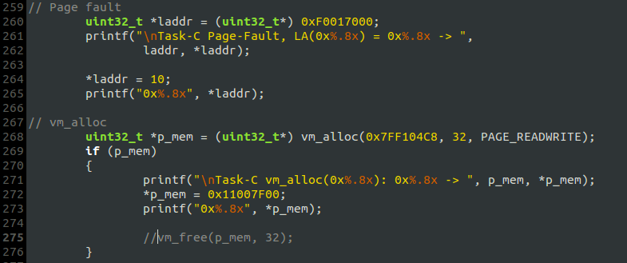
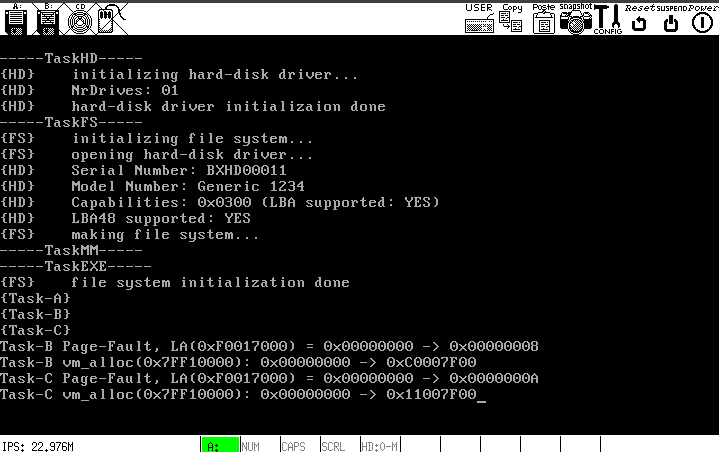
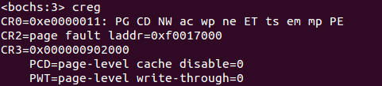
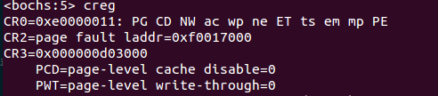
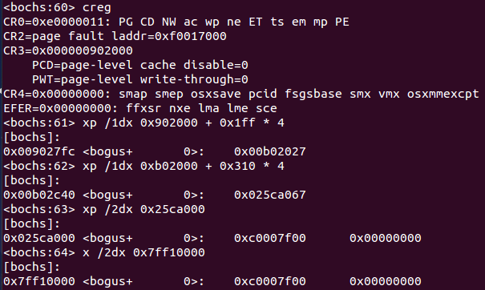
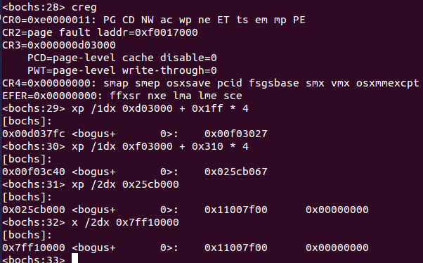

# 虚拟内存管理——独立的进程地址空间
在此之前，所有进程共享一个页表，即拥有相同的地址空间. 通过为每个进程准备一套独立的页表，并将页目录的物理基地址记录在每个进程的PCB里，就可以在进程调度的同时切换`CR3`的内容，使得每个进程拥有独立的虚拟地址空间.

## 一、初始化工作`init_mm()`
- 系统的内存布局没有太大改动，只是将原来的一套页表制作了N份拷贝，并将页目录地址记录到进程表中;
- 记录物理内存信息的双向循环链表`pf_list`仍然紧随页表存放;
- 基于`init_mm()`的工作属性，在`TaskMM`中调用它显然是不合理的，其正确的调用位置应该在`kernel_main()`内部，在完成内存初始化工作后从`proc_begin`开始进程的调度执行. 如此一来，`init_mm()`运行在`Ring 0`上，所以不能调用`printf`.

## 二、`vm_alloc()`、`vm_free()`、`do_page_fault()`
这三个函数操作的页表是当前进程的页表，不同进程之间的虚拟内存分配与释放互不干扰. 下面的测试结果说明了这一点.

## 三、测试
**`TaskB`**:

**`TaskC`**:

**Output:**

### 1. `Page fault`测试

`TaskB`和`TaskC`在同一个线性地址引发`#PF`，两次异常发生时的`CR2`相同，但`CR3`不同，调试时也确实跟踪到了两次`#PF`:

**`#PF`第一次:**

**`#PF`第二次:**

### 2. `vm_alloc`测试
- `TaskB`通过`vm_alloc`在虚拟地址`0x7FF10000`处分配一个虚页，先读出一个整数，内容为`0`；而后写入一个整数`0xC0007F00`;
- `TaskC`同样也在`0x7FF10000`处分配一个虚页，但读出的整数为`0`，不是`TaskB`写入的；而后写入一个整数`0x11007F00`.

**测试结果显示，`TaskB`和`TaskC`的虚拟地址空间是独立的，即，同一个线性地址对应到不同的物理地址. 通过查看二者的页目录、页表，并通过线性地址和物理地址查看内存，可以进一步验证：**

`TaskB:`

`TaskC:`

由图可见，在`TaskB`的地址空间内，虚拟地址`0x7FF10000`被映射到物理地址`0x025CA000`；在`TaskC`的地址空间内则被映射到物理地址`0x025CB000`，二者正好相差`4K`.

**注： 如果`vm_alloc`调用成功后通过`vm_free`释放所分配的虚页，则在`TaskC`内调用`vm_alloc`时，会将虚页映射到之前映射给`TaskB`的那个页框，这时`TaskC`读出的整数就是`TaskB`写入的那个了.**

## 四、remained problem
如果`vm_alloc`的参数`vm_addr`为`NULL`，则应该由`vm_alloc`自己决定虚拟内存的起始分配地址，目前尚未实现该功能. 
