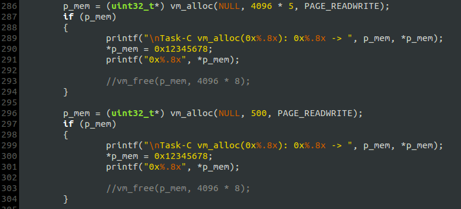
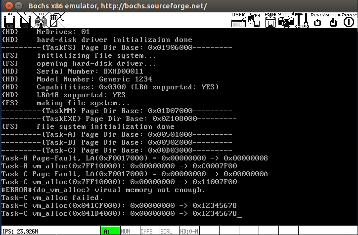
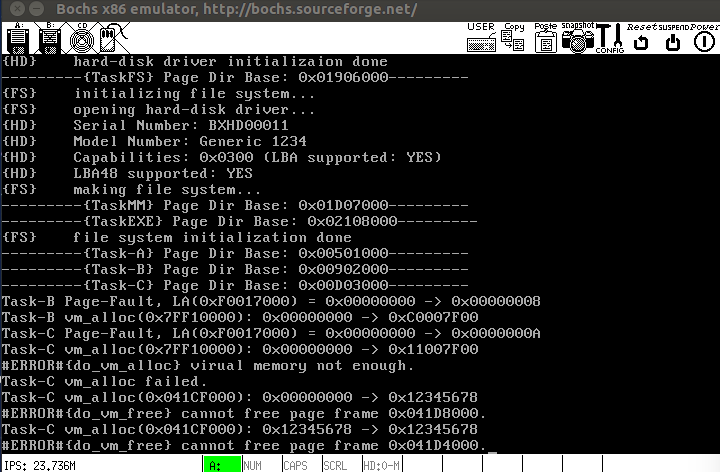

# 修改与补充
## `init_mm()`
- 0号页表（LOADER建立的页表）的拷贝次数改为`NR_PROCS - 1`, 否则`fork`出来的进程没有页表可用；
- 拷贝页表时调整每个页目录里的页表地址值.

## `vm_alloc()`
- 当参数`vm_addr`为`NULL`时，由 `vm_alloc`自行确定虚拟内存的起始分配地址.

## `vm_free()`
- 当一个页框的引用计数为0时不能再将其减1，引用计数小于0是无意义的.

# 测试`vm_alloc`的参数`vm_addr`为`NULL`:

第一次分配的虚拟地址是`0x41CF000`，第二次是`0x41D4000`，二者之差正好是第一次的分配的内存大小——`5 * 4K`，即两次分配的虚拟地址是连续的. 如果调用`vm_free`释放内存，则两次分配得到的虚拟地址是相同的，且都映射到同一个物理页框：

另外，对`vm_free`的错误检测的测试也通过了；之前在`TaskB`和`TaskC`中的内存分配测试依然正确，进程仍保持着独立的虚拟地址空间，本次修改并未破坏该特性.

# BUG
`fork`的内存拷贝存在问题，导致异常.