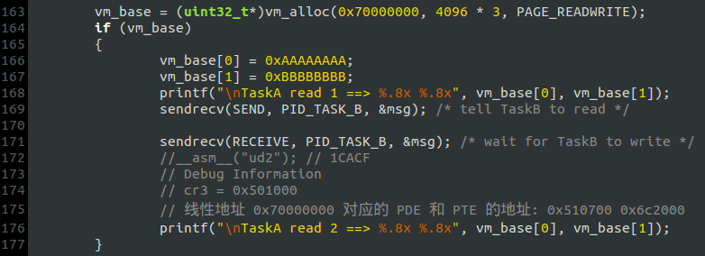
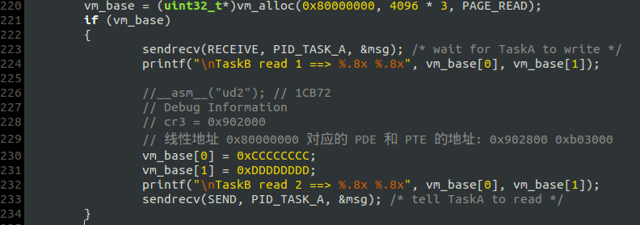
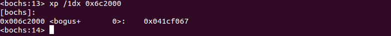
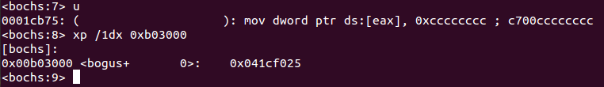
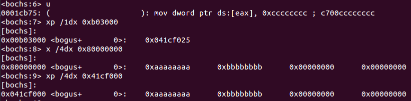
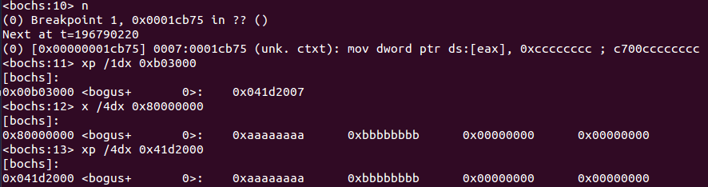
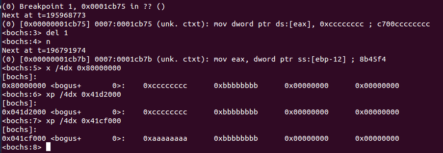
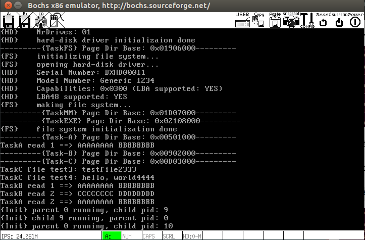
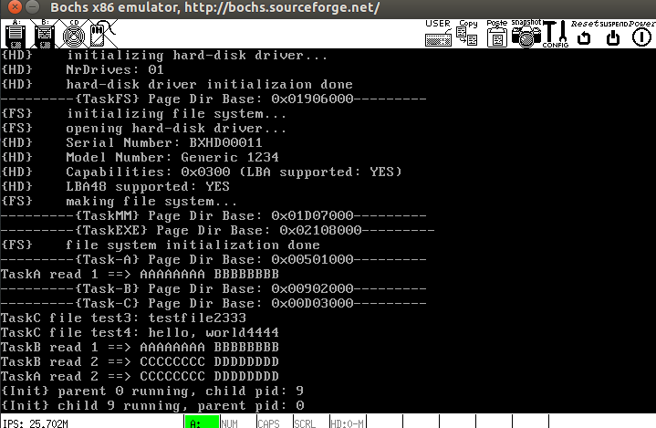

# Copy-On-Write
如果进程A和进程B映射了同一个物理页框，但只有进程A拥有对该页框的写权限，进程B只有读权限（进程对页框的读写权限由`PDE`和`PTE`中的`R/W`属性位决定），那么当进程B试图向该页框写数据时就会引发`#PF`。`do_page_fault`判断出页错误由`Write Protect（写保护）`引起后，执行如下步骤（假设进程Ｂ中引发`#PF`的线性地址为`vm_base`）：

1. 分配一个可读写的页框`P`
2. 将原本的只读页框的数据拷贝到页框`P`
3. 修改进程Ｂ的地址映射关系，将`vm_base`映射到页框`P`

# 测试
需要修改原本的页面分配算法，参见`alloc_frame()`和`vm_alloc()`.

## 测试代码：
`TaskA`:

`TaskB`:

- `TaskA`先在虚拟地址`0x70000000`分配３个可读写页面，并在`vm_base`开头写入两个双字`0xAAAAAAAA`和`0xBBBBBBBB`，然后给`TaskB`发消息;
- `TaskB`收到该消息后读取虚拟地址`0x80000000`处的２个双字(在目前的页面分配算法中,`TaskB`分配的**只读**页面与`TaskA`分配的**可读写**页面均映射到同一个页框，只有这样，*Copy-on-Write*才有意义)，如果系统运行正确，那么`TaskB`读取到的应该是`TaskA`写入的`0xAAAAAAAA`和`0xBBBBBBBB`;
- `TaskB`读取成功后将`vm_base`开头的两个双字重写为`0xCCCCCCCC`和`0xDDDDDDDD`——这将引发`#PF`的*写保护*异常：
	- `#PF`执行`Copy-on-Write`，在`TaskB`的虚拟地址空间中分配一个新的可读写页框，再将虚拟地址`0x80000000`映射的只读页框拷贝过去，最后修改`PDE`和`PTE`，将虚拟地址`0x80000000`映射到新的页框.
	- 中断返回后重新执行引起异常的指令，`0xCCCCCCCC`和`0xDDDDDDDD`被写入到虚拟地址`0x80000000`,但此时地址映射关系已经发生了变化.
- `TaskB`写入成功后，`TaskA`再次读取，但`TaskA`读出来的两个双字还是`0xAAAAAAAA`和`0xBBBBBBBB`，并未受到`TaskB`的影响.

## 调试
### 1. 先验证`TaskA`和`TaskB`映射了同一个页框
- 查看`TaskA`的PTE:

- 查看`TaskB`的PTE:

`TaskA`和`TaskB`的两个不同的虚拟地址都映射`0x041cf000`这个页框，但只有`TaskA`的`PTE.R/W`为１，即只有`TaskA`拥有对该页框的写权限.

### 2. `#PF`前后的变化
#### (1) 先在`TaskB`引发`#PF`的指令处断下来

此时虚拟地址`0x80000000`映射到页框`0x041cf000`，但`PTE.R/W = 0`，说明不可写；再使用虚拟地址和物理地址查看内存，结果页正确.

#### (2) 继续执行，引发`#PF`

使用单步命令`n`后，`0x1cb75`处的指令并没有被跳过，因为中断返回后CPU要重新执行该指令. 但是此时虚拟地址`0x80000000`映射的页框变成了`0x41d2000`，原来的只读页框的内容也被拷贝了过去；另外，`PTE.R/W = 1`，说明该页面可写.

#### (3) `#PF`处理完毕后重新执行引起异常的指令

虚拟地址`0x80000000`、物理地址`0x41d2000`处的内存已被修改为`0xCCCCCCCC`，但物理地址`0x41cf000`处的内存保持原样.

## 运行结果
### 使用`COW`

`TaskA`在`TaskB`写入前后，读出的两个双字都是`0xAAAAAAAA`和`0xBBBBBBBB`，说明`COW`技术使得`TaskA`的页面不被`TaskB`篡改.

### 不使用`COW`, 发生写保护异常后，直接赋予写权限

如此以来，`TaskA`的页面就被`TaskB`篡改了，因为`TaskA`读出的两个双字是`TaskB`所写.