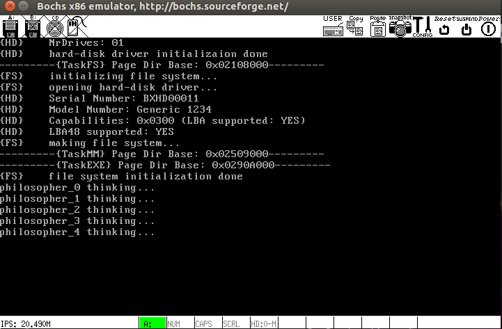
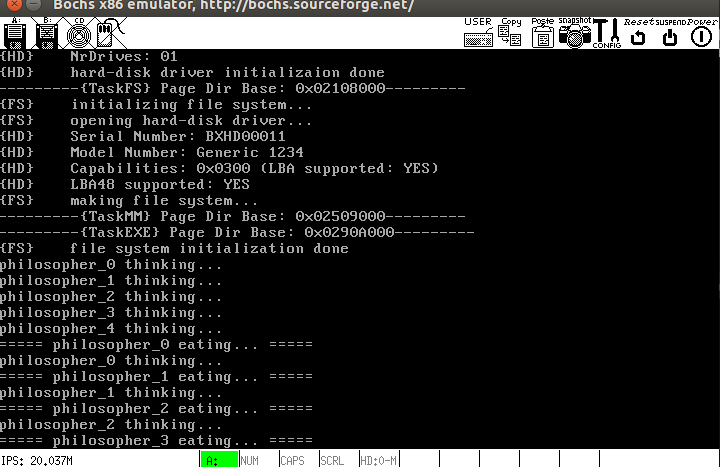
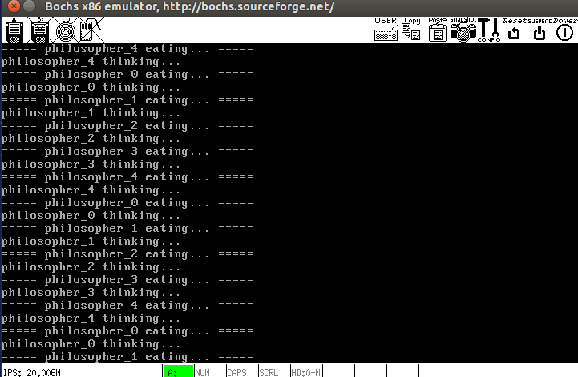

# 哲学家进餐问题
以`kernel/test.c`中的５个进程`TaskA~E`模拟５个哲学家
## 死锁的发生
### 使用`kernel/test.deadlock.c`进行编译：
```
make all image -f Makefile.deadlock
```

得到如下结果：



５个哲学家无法推进，死锁发生

## 无死锁解法
### 使用`kernel/test.c`进行编译：
```
make all image
```

得到如下结果：





５个哲学家合理推进，未发生死锁

***

## 本次主要修改了`sleep`的实现：
以前的`sleep`通过一个`while`循环进行延时，但`sleep`的正确实现应该把当前进程挂起一段时间，不能让其占用CPU，因此需要借助`schedule()`来实现.
