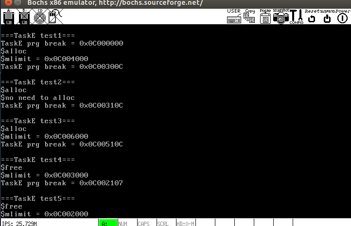
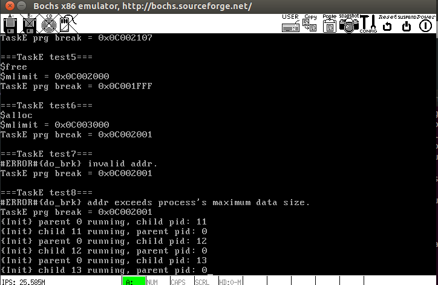

# 实现`brk()`和`sbrk()`
## program break与堆内存模型
在Linux中, *program break*从字面上理解就是进程的程序中断点, `BSS segment`、`Data segment`和`Text segment`认为是属于"程序(program)"的, 因为这些段来自编译链接生成的*可执行模块*，超过这个位置的内存区域则不属于这个*可执行模块*.

`start_brk`指向*program break*的起点, 从这里往上的一段内存便是可以分配给进程使用, 在早期的Linux中, 进程申请内存的系统调用只能是`brk()`和`sbrk()`, 这两个函数通过调整`brk`的位置来将`start_brk`到`brk`之间的虚拟内存映射到物理内存, 从而完成进程的动态内存分配. 这部分内存称为**堆(heap)**. 堆内存的模型如下:

之所以不映射完整个区域, 是因为物理内存的容量有限. 在堆区域, 分配内存就是将`break`向高地址方向移动, 而释放内存就是向低地址方向移动(**注意:这个break不是program break,而是Mapped Region的上界.如果分配的内存大小不是页面的倍数, 则会按照页面大小取上整, program break可以任意, 但不会超过Mapped Region的上界, 在我的实现中通过变量mlimit记录这个上界**), 所以说堆是向高地址方向生长的, 与栈的生长方向相反. 从堆起始地址到`break`之间的地址空间为映射好的，可以供进程访问；而从`break`往上，如果访问这段空间则程序会报错.

## 具体实现
PCB中增设三个成员: `start_brk`,`brk`和`mlimit`, `start_brk`对应上图中的`Heap's Start`, `mlimit`对应上图中的`break`, 表示Mapped Region的上界, `brk`即为*program break*. 初始化时三者都相等, 即`start_brk`和`brk`之间还没有内存可用. 两个函数通过调整`brk`来实现堆内存的分配和释放, 这需要调用`do_vm_alloc()`和`do_vm_free()`. 但不是任何时候都需要分配或释放内存, 如果增加`brk`却没有越过`mlimit`, 则无需映射新的页面; 如果减小`brk`却没有跨页, 亦无需解除页面映射.

`brk()`和`sbrk()`的实现见[mm/brk.c](mm/brk.c).

## 测试
8个test见[kernel/test.c](kernel/test.c)

输出:

8个test的输出结果符合预期.