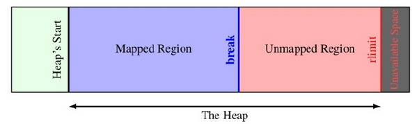
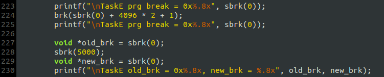
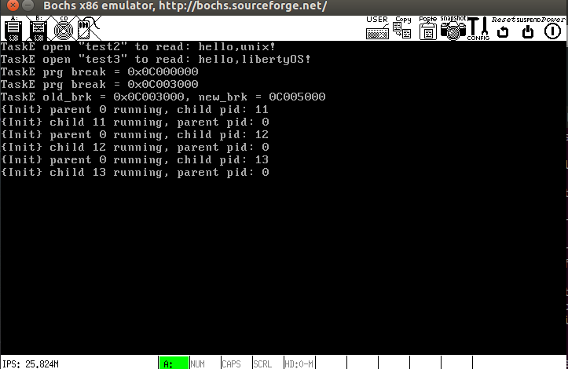

# 实现`brk()`和`sbrk()`
## program break与堆内存模型
在Linux中, *program break*从字面上理解就是进程的程序中断点, `BSS segment`、`Data segment`和`Text segment`认为是属于"程序(program)"的, 因为这些段来自编译链接生成的*可执行模块*，超过这个位置的内存区域则不属于这个*可执行模块*.

`start_brk`指向*program break*的起点, 从这里往上的一段内存便是可以分配给进程使用, 在早期的Linux中, 进程申请内存的系统调用只能是`brk`和`sbrk`, 这两个函数通过调整`brk`的位置来将`start_brk`到`brk`之间的虚拟内存映射到物理内存, 从而完成进程的动态内存分配. 这部分内存称为**堆(heap)**. 堆内存的模型如下:

之所以不映射完整个区域, 是因为物理内存的容量有限. 在堆区域, 分配内存就是将`break`向高地址方向移动, 而释放内存就是向低地址方向移动, 所以说堆是向高地址方向生长的, 与栈的生长方向相反. 从堆起始地址到`break`之间的地址空间为映射好的，可以供进程访问；而从`break`往上，是未映射的地址空间，如果访问这段空间则程序会报错. 需要注意的是, `break`必须是按页对齐的, 且`break`的移动范围是有限的.

## 具体实现
在每个进程表中增设两个成员: `start_brk`和`brk`, 初始化时二者都相等, 即`start_brk`和`brk`之间还没有内存可用. 两个函数通过调整`brk`来实现堆内存的分配和释放, 这需要调用`do_vm_alloc()`和`do_vm_free()`, 所以在我的系统中堆内存的分配与释放本质上就是虚页的分配与释放.

`brk()`和`sbrk()`的实现基本遵循`man`手册中的描述, 参见[mm/brk.c](mm/brk.c).

## 测试
测试代码放在[kernel/test.c](kernel/test.c)的`TaskE`中:

输出:

首先, 通过给`sbrk()`传入参数`0`获得当前*program break*的位置`0x0c000000`, 然后通过`brk()`将其向上增长3页(`4096 * 2 + 1`被向上取整为3页), 再次调用`sbrk(0)`得到新的`program break`的位置页符合预期. 随后由通过`sbrk()`来修改`program break`, 结果也正确. 其他测试，如：通过`brk()`来释放堆内存, 参数不合法会怎么样, 以及虚拟内存的具体映射情况, 均已通过, 不再展示.