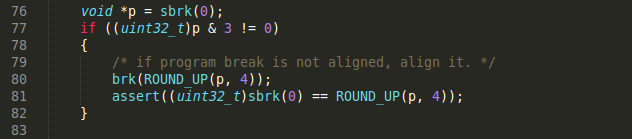

# 修改`malloc`：地址对齐
## BUG
[c](../c/)中实现的`malloc`存在的BUG：返回的地址会出现未对齐的情况, 原因是`extend_heap`直接使用了`sbrk(0)`返回的*program break*, 而用户可以调用`brk`和`sbrk`任意设置*program break*, 所以`sbrk(0)`的返回值就可能是一个未对齐的地址值.

## 修改
`extend_heap`需要对`sbrk(0)`返回的*program break*进行检查, 如果地址未对齐还需要重新将*program break*设置为一个对齐的地址:

## 测试
`TaskA`在调用`malloc`之前先将*program break*设置为未对齐的地址值, 随后检查`malloc`的返回值, 发现均是对齐的地址：

最初通过`sbrk(3)`将*program break*设置为`0C000003`, 然而第一次调用`malloc`时, `extend_heap`将*program break*向上对齐为`0C000004`, 最后的输出也说明了这点.

**为了能输出上述结果，我将`TaskD`的代码全部注释掉, 否则输出会很混乱.**